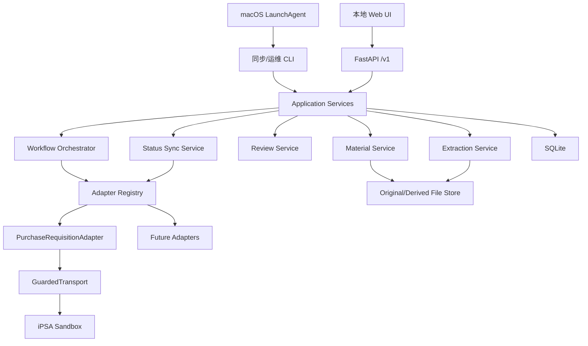
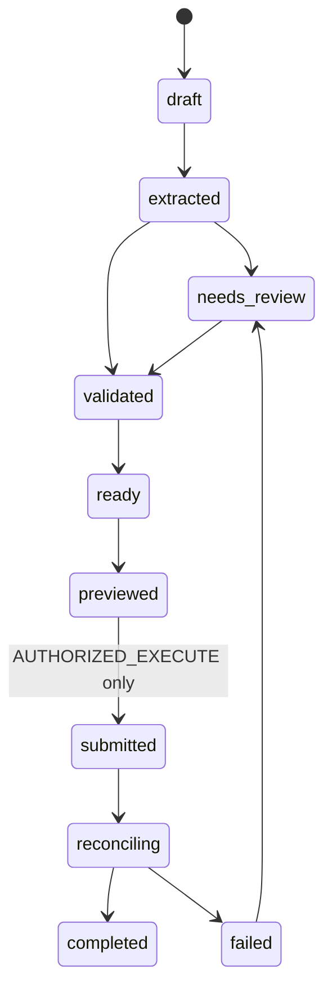

# AI 统一流程中心实施总计划

> 本文件是本项目后续实施的唯一计划基线和断点记录。任何执行者开始工作前，必须先阅读本文件、执行 `git status --short --branch`，再从“当前执行清单”中唯一标记为 `IN_PROGRESS` 的任务继续。不要另建同类计划文件。

## 文档状态

| 项目 | 当前值 |
| --- | --- |
| 计划版本 | `v1.8` |
| 最后更新 | `2026-07-16` |
| 仓库 | `/Users/ethan/Documents/isstech` |
| 基线提交 | `5a7ed71 Implement policy-gated Purchase Requisition replay baseline.` |
| 当前分支 | `main` |
| 当前总阶段 | `P9.7 五类流程栏目语义修复已完成` |
| 当前安全模式 | `CTF_SAFE` |
| 计划维护规则 | 每完成一个门禁，立即更新本文件的状态、结果、文件和下一步 |

状态只使用以下四种：

- `TODO`：尚未开始。
- `IN_PROGRESS`：正在执行；全文件同时只能有一项。
- `BLOCKED`：有明确外部阻断，必须写清解除条件。
- `DONE`：已有可重复证据和验收结果，不是“代码看起来完成”。

---

## 0. 当前断点

### 0.1 本检查点之前已经完成

1. 已建立 Python/FastAPI 项目、Git 首次提交和证据隔离目录。
2. 已实现 `EndpointPolicy + GuardedTransport` 单一出网通道，未知端点默认拒绝。
3. 已确认 `GET .../Delete/{id}`、Upload、Submit、Approve 等写操作会被阻断。
4. 已实现纯 HTTP 登录代码、会话存储、申请列表、详情、附件和写请求预览。
5. `2026-07-15` 已由账号持有人手动输入凭据，使用 Chrome + Computer Use + CDP 完成成功登录及只读业务抓包。
6. 已确认以下运行态协议：
   - 成功登录 POST 字段和回跳到 Portal。
   - `SearchIndex` 初始 GET。
   - `POST /SearchIndex` 空条件查询。
   - `POST /SearchIndex/0/1/False/2` 分页。
   - `GET /Detail/{id}` 只读详情。
   - 详情中的流程轨迹字段：序号、时间、审批人、职位、操作、批注。
   - 查询列表中的当前节点字段：下一级审批人。
   - `ApprovalIndex`、`AdjustIndex`、`RevocationIndex` 初始只读列表。
   - 附件下载真实路径：`/PurchaseRequisition/Download/{id}`。
7. 原始证据均位于 `captures/raw/`，权限为 `0600`，且被 Git 忽略。
8. 已生成脱敏登录协议：`captures/redacted/login-success-protocol.json`。
9. 已参考 GitHub 类似项目：
   - `paperless-ngx/paperless-ngx`：消费插件流水线、临时目录、SHA-256 去重、失败清理和有限重试。
   - `docling-project/docling`：`DocumentConverter` 与格式专属管线分离，结构化文档作为 AI 上游边界。
   - `temporalio/samples-python`：工作流状态持久化、活动级重试和确定性编排的设计方向。
   - `n8n-io/n8n`：节点化适配、显式重试配置和人工介入点的产品形态。

### 0.2 当前工作树与阶段提交

P9 本地 Web 工作台已提交为 `04b7016 Add local unified workflow center workspace`。
P9.1 账号作用域、Portal 身份过滤、`待催办/已过审` 分类、调度解释器修复、真实
只读同步、桌面/移动 QA 和全量门禁均已完成，并提交为
`c1f2e9f Isolate workflow views by authenticated account`。旧
`data/workflow-center.sqlite3` 原样保留但不再作为账号流程数据源；两个中间验证数据集
已保存在 `data/quarantine/`，不进入 Git。Keychain 已配置，LaunchAgent 仍等待执行
时间确认。P9.2 已完成本人单据的账号受限详情、本地抽屉和数据覆盖口径，
并提交为 `dc2fc88 Add account-scoped workflow detail drawer`；
P9.3 已完成“账号有已过审数据，但首次进入默认停在空待催办”的视图修复，
并提交为 `eb0ec9d Select the first non-empty workflow view`；
P9.4 已将账号口径从单一“申请人精确相等”修正为已由 Detail 证明的本人参与关系，
并完成离线详情、current 对账和浏览器令牌恢复；实现、真实 QA 和全量门禁均已通过，
并提交为 `11f32b8 Add participant-scoped cached workflow details`；
P9.5 已完成五个采购流程的账号可见全集同步，真实基线为 353 条，并提交为
`a4c3bab Complete account-visible procurement history sync`。P9.6 正在把展示准入收紧为
“我负责项目的单据或我提交的单据”，并补齐审批人文案与审批轨迹。P7 保持
`BLOCKED`，P10 已由 P9.5 覆盖并标记为 `SUPERSEDED`。P9.6 已完成并提交为
`ab8018d Scope work items and restore approval trails`；P9.7 只修正流程栏目显示语义，
不改变个人单据准入和同步数据。P9.7 已完成固定五流计数、桌面真实数据 QA 和全量
门禁；根据账号持有人要求，本阶段未增加移动端专用实现或移动端交付门禁。

### 0.3 最近一次验证结果

```text
pytest: 298 passed
ruff: passed
OpenAPI: matches runtime
secret scan: passed
evidence hashes and permissions: passed
git diff --check: passed
npm production build: 1593 modules, JS 244.89 kB, CSS 30.07 kB
real source snapshot: 353 account-visible rows across five procurement workflows
real personal-scope baseline: my submissions=11, my projects=32, union=32
real cached approval coverage: 30 non-empty trails, 2 upstream-empty trails
desktop/mobile Browser QA for P9.6: passed with no application warning/error
P9.7 fixed workflow counts: 6/8/0/9/9, union=32
P9.7 desktop Browser QA: order empty state, restored 32 rows, no overflow/overlap/console issue
P9.7 production build: 1593 modules, JS 245.14 kB, CSS 30.07 kB
wheel: 62 files; personal scope, multistream detail and hashed web assets present
repository plist: plutil OK
formal service: 127.0.0.1:8000 health/OpenAPI/new hashed assets OK
```

### 0.4 当前外部阻断

1. 当前竞赛规则仍是“不得篡改系统数据”。因此真实新增、保存、提交、审批、调整、撤销、删除和上传全部禁止。
2. 第二角色 IDOR 验证需要另一合法比赛账号，目前没有执行条件。
3. P8 Keychain 配置已完成，但真实 LaunchAgent 激活仍等待账号持有人确认执行时间。

---

## 1. 最终目标与性能指标

最终产品不是单一网页的协议复现工具，而是一个本地运行的 AI 统一流程中心：

```text
项目材料进入本地收件箱
→ 原文件固化与去重
→ 文档解析/OCR
→ AI 分类、字段抽取和来源定位
→ 规则校验与置信度门禁
→ 人工审阅
→ 请求预览或授权提交
→ 每日拉取流程状态
→ 快照对账与节点变化检测
→ 输出个人待办和定向催办清单
→ 人工反馈修正抽取规则
```

设计必须从以下指标出发：

| 指标 | MVP 门槛 | 稳定版门槛 |
| --- | --- | --- |
| 未授权写请求 | `0` | `0` |
| 原文件可追溯率 | `100%` SHA-256 固化 | `100%` |
| 提取字段来源覆盖率 | 所有必填字段有文件/页码/原文 | `100%` |
| 低置信度人工复核 | `< 0.85` 必须复核 | 阈值可按字段配置 |
| 提交幂等性 | 同一幂等键最多一次外部提交 | `100%` |
| 提交后回读 | 每次提交必须回读确认 | `100%` |
| 状态同步新鲜度 | 每日一次 + 手动触发 | 可配置，默认工作日 08:30 |
| 同步完整性 | 翻页直到总数满足或触发保护门限 | `100%`，禁止静默截断 |
| 失败重试 | 只读请求有限退避，写请求不自动盲重试 | 可观测、可人工恢复 |
| 待办解释性 | 当前节点、责任人、停留天数、来源流程 | `100%` |
| 秘密泄露 | 密码/Cookie/票据不进入 Git 和普通日志 | `0` |

优先级严格为：

```text
稳定性 > 可恢复性 > 正确性 > 速度 > 自动化程度 > 局部最优
```

---

## 2. 工程控制论抽象

将不同流程系统抽象成同一动态闭环：

| 控制对象 | 对应组件 |
| --- | --- |
| 对象 | 外部审批系统及其当前流程状态 |
| 控制器 | 本地编排器、状态机、规则校验器和 AI 映射器 |
| 测量 | 列表查询、详情回读、审批轨迹、附件和错误响应 |
| 执行 | `WorkflowAdapter` 的 preview/submit 方法 |
| 环境 | 网络、账号权限、目标站点变更、时延、限流和人工操作 |
| 扰动 | 页面字段变化、会话过期、网络超时、重复点击、材料缺失 |
| 饱和 | 翻页上限、附件大小上限、重试上限、AI token 上限 |
| 反馈 | 提交后回读、每日快照差异、人工纠错和失败原因 |


先证明一条最小闭环：

```text
PurchaseRequisition SearchIndex
→ 全量翻页
→ 解析状态和下一级审批人
→ 归一化 WorkItem
→ 本地保存快照
→ 输出待办清单
```

这条闭环稳定后，才增加材料 AI 和真实提交能力。

---

## 3. 安全运行模式

### 3.1 `CTF_SAFE`，当前默认

- 允许：登录、GET 页面、已确认只读 POST 查询、分页、详情、审批轨迹、附件下载。
- 允许：材料入库、AI 抽取、人工审阅、请求预览。
- 禁止：新增保存、编辑保存、提交、审批、调整、撤销、删除、上传。
- 传输层对禁止动作必须返回 `BUILD_ONLY` 或 `DENY`，不能依赖 UI 隐藏按钮。

### 3.2 `AUTHORIZED_EXECUTE`，未来显式授权后启用

- 必须由部署配置和针对流程的单独授权共同开启。
- 提交前必须生成不可变预览摘要和幂等键。
- 提交动作需要人工确认。
- 提交后必须回读外部 ID、状态和关键字段。
- 网络超时后状态不明时，先回读，不得直接重发。

严禁通过一个全局布尔值直接放开全部写操作。每个适配器、每个动作单独授权。

---

## 4. 目标架构



### 4.1 边界原则

1. AI 只做分类、抽取、映射和建议，不直接调用外部提交。
2. 所有外部请求必须经过适配器和 `GuardedTransport`。
3. 原文件、派生文本、AI 输出和最终人工确认值分开保存。
4. SQLite 保存状态和索引，不把大文件正文塞进数据库。
5. 调度器只调用可重复 CLI，不依赖 Web UI 常驻。
6. 每个同步运行都有 `run_id`、开始/结束时间、计数和错误摘要。

---

## 5. 文件与保存位置

### 5.1 当前仓库代码

| 目的 | 修改位置 | 产物保存位置 |
| --- | --- | --- |
| 端点安全分类 | `src/isstech_replay/policy.py` | 同文件 |
| 上游 HTTP 行为 | `src/isstech_replay/client.py` | 同文件 |
| 采购领域模型 | `src/isstech_replay/models/purchase.py` | 同文件 |
| 统一待办模型 | `src/isstech_replay/models/work_items.py` | 同文件 |
| 采购 HTML 解析 | `src/isstech_replay/parsers/purchase.py` | 同文件 |
| 附件 HTML 解析 | `src/isstech_replay/parsers/attachment.py` | 同文件 |
| 采购 API | `src/isstech_replay/routes/purchase_requisitions.py` | 同文件 |
| 统一待办 API | `src/isstech_replay/routes/work_items.py` | 同文件 |
| 待办归一化 | `src/isstech_replay/work_items.py` | 同文件 |
| API 注册 | `src/isstech_replay/api.py` | 同文件 |
| CDP 登录脱敏 | `tools/redact_login_cdp.py` | 脱敏 JSON 写入 `captures/redacted/` |
| 合成测试证据 | `tests/fixtures/purchase/` | 只保存 REDACTED 数据 |
| OpenAPI | `tools/export_openapi.py` | `docs/openapi.json` |
| 证据清单 | `docs/evidence-manifest.json` | 同文件 |
| 端点矩阵 | `docs/endpoint-matrix.md` | 同文件 |

### 5.2 后续新增代码

| 阶段 | 新建/修改文件 |
| --- | --- |
| SQLite 持久化 | `src/isstech_replay/storage.py`, `src/isstech_replay/schema.sql` |
| 适配器协议 | `src/isstech_replay/adapters/base.py`, `src/isstech_replay/adapters/purchase_requisition.py` |
| 同步服务 | `src/isstech_replay/sync.py`, `src/isstech_replay/routes/sync.py` |
| 同步 CLI | `tools/sync_work_items.py` 或项目脚本入口 `isstech-sync` |
| 材料入库 | `src/isstech_replay/materials.py`, `src/isstech_replay/routes/materials.py` |
| 文档解析 | `src/isstech_replay/extraction.py` |
| AI 接口 | `src/isstech_replay/ai/base.py`, `src/isstech_replay/ai/provider.py` |
| 草稿状态机 | `src/isstech_replay/workflow_state.py` |
| 人工审阅 API | `src/isstech_replay/routes/drafts.py` |
| 本地 UI | 在 API 稳定后单独立项；不得先做营销页 |
| macOS 调度 | `ops/com.isstech.workflow-center.sync.plist` |

### 5.3 运行数据目录

以下目录必须加入 `.gitignore`：

```text
data/
  workflow-center.sqlite3
  materials/
    originals/<sha256>/<original-name>
    derived/<material-id>/documents/<document-hash>/document.json
    derived/<material-id>/documents/<document-hash>/text.txt
    derived/<material-id>/documents/<document-hash>/pages/*.json
    derived/<material-id>/extractions/<extraction-id>/result.json
  runs/<run-id>/summary.json
  exports/YYYY-MM-DD-work-items.csv
  logs/workflow-center.log
```

证据目录保持：

```text
captures/raw/       原始 HAR/CDP/HTML/JS，0600，永不进 Git
captures/redacted/  经过反向泄漏检查的协议摘要，可进 Git
```

---

## 6. 核心数据模型

### 6.1 材料

```text
Material
  id
  sha256
  original_name
  mime_type
  size_bytes
  original_path
  ingest_status
  created_at

MaterialArtifact
  material_id
  kind: text | page | table | image | metadata
  path
  parser_version
```

### 6.2 带证据的字段

每个 AI 字段必须保留：

```text
ExtractedField
  field_name
  proposed_value
  confidence
  source_material_id
  source_page
  source_text
  extractor_version
  review_status
  confirmed_value
```

### 6.3 流程草稿状态机



不允许跳过 `validated`、`previewed` 和提交后 `reconciling`。

### 6.4 审批快照与待办

```text
WorkflowSnapshot
  adapter
  external_id
  reference_no
  status
  current_node
  current_approver
  submitted_at
  observed_at
  payload_hash

WorkItem
  key
  workflow
  external_id
  title
  applicant
  status
  current_approver
  waiting_days
  source_url
```

快照差异用于识别：新单据、节点变化、审批完成、责任人变化和长时间停留。

---

## 7. `WorkflowAdapter` 契约

所有流程适配器最终实现同一最小协议：

```python
class WorkflowAdapter(Protocol):
    name: str

    def list_records(self, cursor: SyncCursor | None = None) -> Page: ...
    def get_record(self, external_id: str) -> WorkflowRecord: ...
    def get_attachments(self, external_id: str) -> tuple[Attachment, ...]: ...
    def build_draft(self, confirmed_fields: dict[str, object]) -> Draft: ...
    def preview_submit(self, draft: Draft) -> RequestPreview: ...
    def submit(self, draft: Draft, authorization: ExecutionAuthorization) -> SubmitResult: ...
    def reconcile(self, result: SubmitResult) -> WorkflowRecord: ...
```

当前 `PurchaseRequisition` 是第一个适配器。`submit()` 在 `CTF_SAFE` 中必须不可达。

---

## 8. 分阶段实施

## P0 证据与登录协议收口

状态：`DONE`

### 修改文件

```text
tools/redact_login_cdp.py
tools/redact_login_har.py
tests/test_redact_login_cdp.py
captures/redacted/login-success-protocol.json
docs/evidence-manifest.json
docs/endpoint-matrix.md
docs/login-capture-runbook.md
docs/final-verification.md
docs/vulnerability-report.md
tools/verify_evidence.py
```

### 操作步骤

1. 用 `tools/redact_login_cdp.py` 从原始 CDP JSON重新生成脱敏摘要。
2. 确认摘要只包含字段名、状态码、允许的 URL、Cookie 名和属性，不含值。
3. 将 `2026-07-15` 原始证据哈希、权限、来源和敏感级别登记到单一 manifest。
4. 将旧的 `login-success-har` gap 改为“成功 CDP 已捕获，纯 HTTP live smoke 待凭据”。
5. 运行秘密扫描和证据校验。

### 验收

```text
redactor unit tests pass
login protocol reproducible from raw capture
raw files mode 0600
raw files ignored by Git
redacted protocol contains no credential/cookie/ticket values
evidence manifest hashes all match
```

### 实际结果（2026-07-15）

- 十个 CDP raw 文件和一个脱敏登录摘要已登记到 manifest，哈希匹配。
- raw CDP 全部是 `0600` 且命中 `captures/raw/**` Git 忽略规则。
- 登录摘要能由 `tools/redact_login_cdp.py` 从 raw 逐字节重建。
- 摘要明确记录浏览器请求已携带 `.iPSA` 名称，不把该证据误写成干净会话签发证明。
- 全量 `pytest` 95 项、Ruff、OpenAPI、秘密扫描、证据校验和 diff 检查全部通过。
- 剩余登录门禁是运行时凭据驱动的纯 HTTP live smoke，不需要再次浏览器导航。

## P1 PurchaseRequisition 只读适配器闭环

状态：`DONE`

### 修改文件

```text
src/isstech_replay/policy.py
src/isstech_replay/client.py
src/isstech_replay/models/purchase.py
src/isstech_replay/parsers/purchase.py
src/isstech_replay/parsers/attachment.py
src/isstech_replay/routes/purchase_requisitions.py
tests/fixtures/purchase/*.html
tests/test_purchase.py
tests/test_attachments.py
tests/test_safety.py
tests/test_api.py
README.md
docs/architecture.md
docs/scope.md
docs/endpoint-matrix.md
```

### 操作步骤

1. 精确放行五个列表视图的 GET 和已观察到的只读 POST。
2. 保持 Delete/Submit/Approve/Adjust/Revocation/Upload 等写路径优先匹配 `BUILD_ONLY`。
3. 使用真实 `/Detail/{id}`，不再把 `/Edit/{id}` 当默认详情来源。
4. 使用真实 `/PurchaseRequisition/Download/{id}` 下载附件，旧静态路径只保留兼容规则。
5. 列表解析增加 `next_approver`。
6. 详情解析增加基本信息和 `approval_steps`。
7. 修复 onclick 带引号的附件 ID 解析。
8. 用脱敏合成夹具测试，再用本机 raw capture 做不输出业务数据的反向校验。

### 验收

```text
five views are live-enabled read-only
SearchIndex POST and pagination POST reproduce observed paths
Detail parser returns fields and approval steps
attachment parser matches all observed attachment IDs
all write-path policy tests still block before transport
```

### 实际结果（2026-07-15）

- Search raw 反向解析为总数 78、当前页 10、ID 全部非空且存在下一级审批人。
- 已保存 Detail raw 反向解析为 11 个字段、5 个附件、5 个下载 ID。
- 审批中 Detail raw 反向解析为 11 个字段、5 个审批步骤且审批人字段完整。
- `Detail/{id}` 是唯一 live 详情规则；未观察的 `Details/View/Display` 别名被拒绝。
- `Edit/{id}` 与 `ProjectSelection` 在 `CTF_SAFE` 下改为 `BUILD_ONLY`，不再出网。
- Delete/Submit/Approve/Adjust/Revocation/Upload/Attachment Delete 动作矩阵全部在 transport 前阻断。
- Search 首次筛选和分页 POST 字段与 CDP 对齐；分页不再携带 `btnSearch` 或表单内 `X-Requested-With`。
- 上游 4xx/5xx、列表 DOM 漂移、详情 DOM 漂移和附件 HTML 错误页均显式失败，不再静默产出空结果或错误哈希。
- 全量 `pytest` 111 项、Ruff、OpenAPI、秘密扫描、证据校验和 diff 检查全部通过。

## P2 统一待办只读输出

状态：`DONE`

### 修改文件

```text
src/isstech_replay/models/work_items.py
src/isstech_replay/work_items.py
src/isstech_replay/routes/work_items.py
src/isstech_replay/api.py
tests/test_work_items.py
tests/test_api.py
docs/openapi.json
```

### 操作步骤

1. 将 `SearchIndex` 中“审批中且存在下一级审批人”的记录归一化为 `WorkItem`。
2. 计算停留天数，解析失败时返回 `null`，禁止猜日期。
3. 全量同步必须逐页读取，满足总数、空页、重复页或 `max_pages` 任一终止条件。
4. 输出按停留天数降序排列。
5. `/v1/work-items` 第一版只返回实时结果，不写数据库。

### 验收

```text
GET /v1/work-items returns only actionable records
every item has workflow, external_id, current_approver, status, source_url
pagination cannot silently loop forever
OpenAPI matches runtime
```

### 实际结果（2026-07-15）

- `/v1/work-items` 只输出“审批中且存在下一级审批人”的记录，真实 Search raw 得到 1 条可催办项。
- 每项均有 workflow、合法 external_id、current_approver、status 和真实 `Detail/{id}` source URL。
- `waiting_days` 以申请创建日期为当前可得的等待年龄基准；非法或未来日期返回 `null`，不猜测为 0。
- 排序为已知等待天数降序、未知日期最后，并用 reference/external ID 保证确定性。
- 全量翻页只有在达到上游声明总数，或无声明总数时观察到可信末页才成功。
- 短页、空页、重复页、总数漂移、无稳定身份和 `max_pages` 饱和均抛出 `PaginationIncompleteError`，禁止静默截断。
- 本地 API 冒烟：`/health` 200、`/docs` 200、OpenAPI 包含 work-items；无凭据 purchase/work-items 均为 401 `AUTH_EXPIRED`。
- 全量 `pytest` 121 项、Ruff、OpenAPI、秘密扫描、证据校验和 diff 检查全部通过。

## P3 SQLite 快照、差异和同步 CLI

状态：`DONE`

### 修改文件

```text
.gitignore
src/isstech_replay/schema.sql
src/isstech_replay/storage.py
src/isstech_replay/sync.py
src/isstech_replay/routes/sync.py
tools/sync_work_items.py
tests/test_storage.py
tests/test_sync.py
```

### 操作步骤

1. 建立 SQLite schema 和 `PRAGMA user_version` 迁移门禁。
2. 每次同步建立 `sync_run`，事务内写入快照和差异。
3. 使用 `(adapter, external_id, observed_at)` 保留历史，使用 payload hash 避免无变化重复事件。
4. 生成 `new`、`node_changed`、`completed`、`assignee_changed` 事件。
5. CLI 支持 `--dry-run`、`--json`、`--csv`、`--max-pages`。
6. CLI 失败必须非零退出，不能静默吞掉半次同步。

### 保存位置

```text
data/workflow-center.sqlite3
data/runs/<run-id>/summary.json
data/exports/YYYY-MM-DD-work-items.csv
```

### 验收

```text
same snapshot replay is idempotent
node change produces exactly one event
failed run is recorded and transaction remains consistent
CSV contains no password/cookie/ticket
```

### 实际结果（2026-07-15）

- SQLite schema version 1 已建立，wheel 内含 `schema.sql`；未来版本、未版本化非空库和缺表库均拒绝打开。
- 数据库、run JSON 和 CSV 路径位于 `data/`，全部 Git 忽略；创建文件权限为 `0600`。
- 同步先完整读取，再在一个事务内追加历史、更新当前态、生成事件并完成 run；任一快照失败时整批回滚。
- 失败同步和 CLI 登录失败均写 `failed` run，错误信息会脱敏 password/Cookie/ticket/token 等值。
- 相同状态次日重放追加测量但不重复生成事件；相同观测键同 payload 复用历史，不同 payload 冲突失败。
- 支持 `new`、`node_changed`、`assignee_changed`、`completed`；active 转终态只生成一个 completed，避免节点/责任人清空噪声。
- 过期观测不能覆盖较新的 current；单次缺失不被猜成 completed。
- CLI 支持 `--dry-run`、`--json`、`--csv [PATH]`、`--max-pages`，失败非零退出，CSV 防公式注入。
- FastAPI 新增 `POST /v1/sync/work-items`，只修改本机 SQLite；`dry_run=true` 不创建数据库。
- 全量 `pytest` 141 项、Ruff、OpenAPI、秘密扫描、证据校验、Git 忽略、diff 和本地 API 冒烟全部通过。

## P4 本地材料入库

状态：`DONE`

### 修改文件

```text
src/isstech_replay/materials.py
src/isstech_replay/routes/materials.py
tests/test_materials.py
```

### 操作步骤

1. 提供拖入目录和 API 上传两种入口。
2. 流式计算 SHA-256，先写临时文件，再原子移动到 originals。
3. 同哈希文件只建立引用，不重复复制。
4. 原文件只读保存，派生产物写 derived。
5. MIME、扩展名和文件头不一致时进入人工检查。

### 验收

```text
duplicate ingest is idempotent
interrupted copy leaves no valid record pointing to partial file
original is never overwritten by derived output
```

### 实际结果（2026-07-15）

- SQLite 通过显式 migration 从 schema v1 升到 v2，已有 sync run 保留；wheel 包含 migration 和材料模块。
- 文件/目录 CLI 与受本地 Bearer 会话保护的 multipart API 均已实现，API 还支持列表、详情和原件读取。
- 输入按块写入同文件系统 staging，受 100 MiB 默认上限约束，完成 SHA-256 后原子移动。
- 原件规范路径为 `data/materials/originals/<sha256>/blob`，权限 `0400`；派生产物路径固定在独立 `derived/<material-id>/`。
- 相同内容和文件名重复投递返回同一 material；相同内容不同文件名建立不同引用但共用一个 blob。
- PDF、OOXML、PNG/JPEG/GIF/TIFF、JSON/文本等做文件头检测；扩展名、声明 MIME、检测 MIME 冲突进入 `needs_review`。
- 路径型文件名、符号链接、超限、流中断、损坏 blob 和 data 目录自摄入均拒绝或明确失败。
- 离线双次 CLI 冒烟得到 `blobs=1`、`materials=1`、第二次 deduplicated、原件 mode 400、staging 空。
- 全量 `pytest` 158 项、Ruff、OpenAPI、秘密扫描、证据校验、Git 忽略、diff 和 wheel 检查全部通过。

## P5 文档解析与 AI 字段抽取

状态：`DONE`

### 工具选择

- PDF/DOCX/XLSX/PPTX 优先用当前工作区已有解析能力。
- 复杂 PDF/OCR 评估 Docling；只有真实样本证明标准工具不足时才引入重依赖。
- AI provider 必须可插拔，密钥只从环境或系统钥匙串读取。

### 修改文件

```text
src/isstech_replay/extraction.py
src/isstech_replay/ai/base.py
src/isstech_replay/ai/provider.py
src/isstech_replay/field_mapping.py
src/isstech_replay/models/extraction.py
src/isstech_replay/routes/extractions.py
src/isstech_replay/migration_003_extraction.sql
src/isstech_replay/storage.py
tools/extract_material.py
tests/test_extraction.py
tests/test_field_mapping.py
tests/test_storage.py
tests/test_api.py
```

### 验收

```text
every proposed field has source material/page/text
required fields without evidence cannot become ready
AI output cannot directly call adapter submit
```

### 实际结果（2026-07-15）

- PDF、DOCX、XLSX、PPTX、UTF-8 文本和 JSON 先转换为有界
  `StructuredDocument`；无文本 PDF、截断、MIME 冲突和解析问题全部进入复核。
- XLSX 原件以无扩展名 `blob` 保存仍可通过持续打开的二进制流只读解析；
  本地规则同时识别冒号行和 Office 表格的制表符单元。
- 结构化文档按内容哈希原子保存；重复命中会逐文件比对，损坏目录不会被
  静默当作幂等成功。
- 默认 `local_rules` 可重复运行；可选 `http_json` 仅显式配置启用，流式
  限长、严格 JSON 类型、外部强制 HTTPS，并拒绝 iPSA/Passport 作为端点。
- 字段白名单、必填、`0.85` 阈值、material/source 单元、source label、
  exact excerpt 和 value 定位全部在 provider 后二次校验。
- schema v2 升级到 v3 后保留已有材料；抽取 run、字段 evidence、问题和
  脱敏失败原因写 SQLite，所有字段初始 `review_status='pending'`。
- 新增 `POST /v1/materials/{material_id}/extractions`、
  `GET /v1/extractions/{extraction_id}` 和离线 `tools/extract_material.py`。
- 离线 smoke 得到 `succeeded|1|3|0`，三个必填字段 evidence 有效、状态
  pending、结果文件 `0600`；wheel 包含 migration 和 P5 运行模块。
- 全量 `pytest` 205 项、Ruff、OpenAPI、秘密扫描、证据校验和 diff 检查通过。

## P6 人工审阅与草稿状态机

状态：`DONE`

### 修改文件

```text
src/isstech_replay/workflow_state.py
src/isstech_replay/models/drafts.py
src/isstech_replay/migration_004_review.sql
src/isstech_replay/storage.py
src/isstech_replay/routes/drafts.py
tests/test_workflow_state.py
tests/test_api.py
```

### 最小闭环与状态约束

```text
一个 extraction
→ 幂等创建一个 workflow draft
→ 展示 AI 原建议/原 evidence（只读）
→ 人工逐字段 confirmed/rejected，可另给精确来源片段
→ validate 重新对照结构化文档
→ validated
→ ready
```

1. extraction 为 `succeeded` 时草稿初态是 `extracted`；为
   `needs_review` 时初态是 `needs_review`；failed/running 不可建草稿。
2. 每个 profile 字段都有 draft field。AI 未提出的可选字段标记
   `not_proposed`；缺失的必填字段保持 `pending`，必须人工补值和 evidence。
3. AI 的 `proposed_value`、confidence、source 和 P5 validation issues 只通过
   `source_field_id` 回读，P6 不更新这些原始列。
4. 人工动作只更新 review decision、confirmed value、人工 evidence、reviewer
   和时间；同时同步 P5 `extracted_fields.review_status/confirmed_value`，但不
   改原建议。
5. proposed 字段不得保持 pending；required 字段不得 rejected；confirmed
   字段必须有非空值和可在原/人工 source excerpt 中精确定位的 evidence。
6. 低置信度建议只有经人工 confirmed 后才视为已处置；document issue、
   无效 evidence 和未确认必填字段会让 validate 回到/停在 `needs_review`。
7. 只允许 `extracted|needs_review → validated → ready`。字段只能在前两个
   状态修改；P6 不实现 previewed/submitted。
8. 所有写入使用 `expected_version` 乐观锁；重复/过期 UI 操作返回冲突，
   不静默覆盖另一位审阅者结果。
9. draft 创建、字段审阅、校验成功/失败和 ready 都写 append-only audit
   event，记录 actor、前后状态、字段和结构化 details。

### 保存位置

```text
data/workflow-center.sqlite3
  workflow_drafts
  draft_fields
  draft_audit_events
```

不生成新的上游请求文件。P5 的原件、document 和 extraction result 路径保持
不变；P6 状态只写本机 mode `0600` SQLite。

### 本阶段网站与工具

- 只看本地 `http://127.0.0.1:8000/docs` 和 `/v1/drafts/*`；不需要打开
  iPSA/Passport，不做新的目标抓包。
- 使用 `pytest` 验证状态迁移、证据重校验、审计和并发冲突；使用
  `sqlite3` 反查原建议未变；使用本地 FastAPI/TestClient 做 API 闭环。
- P6 完成前仍由 `EndpointPolicy` 阻断所有目标写操作。

### 验收

```text
invalid state transitions are rejected
review changes preserve original AI proposal and reviewer identity
ready state requires all mandatory validations
stale expected_version cannot overwrite a newer review
no P6 route can reach GuardedTransport or adapter submit
```

### 实际结果（2026-07-15）

- schema v4 新增 `workflow_drafts`、`draft_fields`、`draft_audit_events`；
  v3→v4 保留已有 material、extraction 和 extracted field。
- 一个 extraction 幂等映射到一个 draft；成功抽取初态 `extracted`，有门禁
  问题的抽取初态 `needs_review`，failed/running 无法建草稿。
- 五个采购 profile 字段全部进入 draft；AI 未建议的可选字段是
  `not_proposed`，缺失必填字段保持 pending，可由人工值和精确 evidence 补齐。
- P6 只更新 decision、confirmed value、人工 evidence、reviewer/time；P5
  proposed value、confidence 和原 source 保持不变。
- 字段审阅、校验成功/失败和 ready 在 SQLite 单事务中检查
  `expected_version`、递增 version 并追加同序号 audit event；过期操作返回
  `409 CONFLICT`。
- audit 表有 SQLite UPDATE/DELETE trigger；测试证明普通写连接不能篡改事件。
- validate 重新解析不可变原件并复用 P5 exact-source 校验；人工确认可处置低
  confidence，但无效 evidence、pending 建议、缺失/拒绝必填和 document issue
  均保持 `needs_review`。
- 只实现 `extracted|needs_review → validated → ready`；validated 后字段锁定，
  P6 没有 previewed/submitted 路由，也不引用 `GuardedTransport`。
- 新增 draft 创建/读取、字段审阅、validate 和 ready API；reviewer 固定取
  当前 session username，不接受请求体自报身份。
- 全量 `pytest` 216 项、Ruff、OpenAPI、秘密扫描、证据校验和 diff 检查通过。

## P7 一键提交双模式

状态：`BLOCKED`

解除条件：赛事规则明确允许写入，或提供专用可回滚测试记录。

### 当前可做

- AI 填写。
- 人工确认。
- 生成精确请求预览。
- 计算幂等键和预览摘要。
- 拦截并中止浏览器写请求用于协议取证。

### 当前不可做

- 向目标发送真实 Create/Edit/Submit/Approve/Adjust/Revoke/Delete/Upload。

## P8 每日调度

状态：`BLOCKED`

阻断仅针对真实激活：账号持有人尚未通过本机安全提示配置 Keychain，也尚未
最终确认默认工作日 08:30。设施代码、plist、测试和安装器已经完成并提交。

### 设施

- macOS `launchd`，不使用依赖 Web UI 存活的内置定时器。
- LaunchAgent：`ops/com.isstech.workflow-center.sync.plist`。
- 默认每天工作日 08:30，最终时间由用户确认。
- 凭据优先系统钥匙串或受限环境注入，不写 plist 明文。

### 修改文件

```text
ops/com.isstech.workflow-center.sync.plist
src/isstech_replay/scheduler.py
tools/scheduled_sync.py
tools/configure_sync_keychain.py
tools/install_launch_agent.py
tests/test_scheduled_sync.py
README.md
docs/architecture.md
docs/final-verification.md
```

### 最小调度闭环

```text
launchd 工作日 08:30 唤醒
→ tools/scheduled_sync.py
→ macOS Keychain 限时读取 username/password
→ 子进程调用现有 tools/sync_work_items.py --json --csv
→ 现有完整翻页/SQLite 事务/summary/CSV 路径
→ wrapper 只记录脱敏计数与退出状态
→ 非零退出供 launchctl 和人工排障
```

1. 调度 wrapper 不复制同步逻辑，必须调用手工同步的同一 CLI 文件。
2. plist 只包含绝对 Python/脚本/工作目录、日历和非敏感参数；不得包含
   username、password、Cookie、ticket 或 AI key。
3. 两个 iPSA 凭据值放 macOS Keychain，service 名固定，account 使用本机
   登录用户名；配置工具使用交互输入，不接受密码命令行参数。
4. Keychain 读取、同步子进程和 `launchctl` 操作全部有 timeout；超时后退出，
   不能等待用户操作无限挂起。
5. wrapper 捕获同步 CLI 的 JSON/stdout，不把完整 work item 写普通 launchd
   日志；仅将 run_id、status、计数、时间和脱敏错误追加到 mode `0600`
   `data/logs/scheduled-sync.log`。
6. LaunchAgent stdout/stderr 指向 `/dev/null`，可观察性由受限日志、SQLite
   sync run 和 `data/runs/<run-id>/summary.json` 提供。
7. 安装工具用 `plistlib` 解析/改写模板，原子写入
   `~/Library/LaunchAgents/com.isstech.workflow-center.sync.plist`，mode `0600`；
   支持 `--dry-run`、自定义 hour/minute、bootstrap 和 uninstall。
8. 默认周一至周五 08:30；在用户确认其他时间前不擅自改变该默认值。
9. 当前无运行时凭据时只完成代码、mock/本地验证和安装 dry-run，不加载一个
   每天必然失败的真实 agent。实际 bootstrap 是独立人工验收门禁。

### 保存位置

```text
仓库模板: ops/com.isstech.workflow-center.sync.plist
安装文件: ~/Library/LaunchAgents/com.isstech.workflow-center.sync.plist
受限日志: data/logs/scheduled-sync.log
同步状态: data/workflow-center.sqlite3
运行摘要: data/runs/<run-id>/summary.json
待办导出: data/exports/YYYY-MM-DD-work-items.csv
```

### 本阶段网站与工具

- 不需要打开网站或 Computer Use；真实执行仍是现有纯 HTTP 只读客户端。
- 使用 `plistlib`、`launchctl print/bootstrap/bootout`、macOS `security`、
  `pytest` mock subprocess、`plutil -lint` 和一次安装 `--dry-run` 验证。
- 凭据配置完成后的 live gate 只读取 SearchIndex，不访问 P7 写路径。

### 验收

```text
manual CLI and scheduled CLI execute same code path
app closed时 schedule still works
failure has exit code, run record and可定位日志
plist/log contain no credential values
keychain/subprocess timeout cannot hang indefinitely
```

### 实际结果（2026-07-15，设施代码）

- `src/isstech_replay/scheduler.py` 限时读取两个固定 Keychain service，并以
  子进程环境调用现有 `tools/sync_work_items.py --json --csv`；没有复制同步逻辑。
- wrapper 只把 run ID、状态、观测/待办/事件计数、exit code 和脱敏错误追加
  到 mode `0600` JSONL；测试证明凭据值和 work item 内容不进入该日志。
- Keychain 失败不启动同步；child 非零保留可解析 run ID；sync 超时返回 124；
  其他启动错误也非零并留日志。
- `tools/configure_sync_keychain.py` 不接受凭据参数；使用 `/usr/bin/security`
  末位 `-w` 安全提示，支持 verify-only 和 delete。
- 默认 plist 是周一至周五 08:30、`Umask=0077`、stdout/stderr `/dev/null`，
  不含 username/password/Cookie/ticket/API key；仓库和 dry-run plist 均通过
  `plutil -lint`。
- 安装器支持 dry-run、自定义 hour/minute、write-only、bootstrap、uninstall；
  有界调用 launchctl，不使用可能无限阻塞的 `bootout --wait`。
- 更新前保存 mode `0600` `.backup`；lint 失败不停止旧服务，bootstrap/enable/
  print 失败恢复旧文件，并在旧服务原已加载时尝试恢复 bootstrap。
- P8 focused 10 项与全量 `pytest` 226 项通过；Ruff、OpenAPI、秘密扫描、
  证据校验和 diff 检查通过。
- 尚未执行真实 Keychain 配置和 LaunchAgent bootstrap；解除条件是账号持有人
  在本机安全提示中输入凭据并确认默认 08:30 或指定其他时间。

## P9 本地统一流程中心 Web 工作台

状态：`DONE`

### 目标用户闭环

```text
本地登录
→ 总览今日待办/本地材料/待审草稿/最近同步
→ 拖入材料并开始抽取
→ 查看 AI 值和逐字段来源
→ 人工确认/拒绝/修正 evidence
→ validate → ready
→ 查看 SQLite 当前催办清单
→ 手动触发只读同步并观察结果
```

### 修改与保存位置

```text
前端源码: web/
构建产物: src/isstech_replay/web_dist/
静态服务: src/isstech_replay/api.py
本地聚合/列表 API: src/isstech_replay/routes/drafts.py,
                    src/isstech_replay/routes/extractions.py,
                    src/isstech_replay/routes/work_items.py
前端/API 测试: tests/test_ui.py, tests/test_api.py
```

### 最小设计

1. 根路径直接是工作台，不做营销 landing page。未登录时显示紧凑登录面板；
   token 只放 `sessionStorage`，不显示/持久化上游 Cookie。
2. 安静、密集、操作型布局：左侧视图导航，顶部连接/同步状态，主区按总览、
   材料、审阅草稿、催办清单切换；不使用大 hero、装饰卡片或渐变背景。
3. 新增只读列表 API，使刷新后仍能恢复 extraction/draft/current snapshot，
   不依赖前端内存保存 ID。
4. 材料页支持 drag/drop 与文件选择、进度/错误、MIME review 状态、开始
   local_rules 抽取并幂等创建 draft。
5. 草稿页同时显示 AI 原建议、confidence、原 evidence、人工值/人工 evidence、
   validation issues 和 audit；所有修改携带最新 `expected_version`，409 后刷新。
6. 只有状态允许时显示 validate/ready；不显示或实现 submit、upload-to-iPSA、
   approve、delete 等 P7 动作。
7. 催办页优先读取 SQLite 当前快照，展示责任人、状态、等待天数和详情链接；
   手动同步调用现有只读 API，失败不清空旧快照。
8. React/Vite 仅作为本地构建工具；运行时由 FastAPI 同源提供构建产物，
   不依赖 Node dev server或第三方 CDN。图标使用 `lucide-react` 构建进 bundle。
9. 固定桌面/移动尺寸做浏览器 screenshot、console/network error、文本溢出、
   点击和响应式检查；构建产物必须进入 wheel。

### 需要看的网站与工具

- 实际产品：`http://127.0.0.1:8000/`；API 文档：`/docs`。
- 使用 Browser/Playwright 检查渲染、交互、console、网络和桌面/移动截图。
- 不需要打开 iPSA 页面做 UI 开发；真实同步仍通过既有只读 HTTP 客户端。

### 验收

```text
material -> extraction -> draft -> reviewed -> validated -> ready works in UI
refresh can recover drafts/extractions/current work items from SQLite
409 stale version refreshes instead of overwriting
no UI action or API route can submit upstream
desktop/mobile screenshots have no overlap, clipping, blank primary view, or console error
FastAPI wheel serves the built root UI without Node installed
```

### 实际结果（2026-07-15）

- `web/` 已实现总览、材料、草稿审阅和催办清单；FastAPI 根路径同源提供
  `src/isstech_replay/web_dist/`，运行时不依赖 Node 或第三方 CDN。
- 新增本地恢复列表：`GET /v1/extractions`、`GET /v1/drafts`、
  `GET /v1/work-items/current`、`GET /v1/sync/runs`；刷新后可恢复全部工作状态。
- 已用隔离 mock 上游和临时 SQLite 证明：登录、材料、local_rules 抽取、草稿、
  三个必填证据确认、`validated -> ready`、只读同步、催办筛选和刷新恢复。
- 通过第二本地会话把草稿从 v1 推进到 v2 后，旧 UI 写入得到 409、显示冲突并
  刷新到 v2；待处理字段未被覆盖。
- 修复全新数据库五路并发读取时的迁移竞争；线程锁加 mode `0600` 有界进程锁
  串行化 schema 初始化，8 路并发回归连续五轮通过。
- 空成功同步即使没有可催办快照也保留最近 `observed_at`，不再误报“尚无快照”。
- 桌面 `1440x900` 和移动 `390x844` 检查无全页横向溢出、空白主视图或 console
  error/warn；移动宽表只在自身容器滚动，紧凑图标按钮保留 accessible name。
- Vite 构建 1,592 modules；JS `234.24 kB`（gzip `71.75 kB`），CSS
  `23.72 kB`（gzip `5.32 kB`）；wheel 含入口、哈希 JS/CSS、schema 和 migrations。
- 内置 Browser 不支持设置本地文件；本地 multipart API 和自动化测试已验证。
  Chrome 原生选择器能选中 QA 文件，但扩展未开启 file URL 权限，未把此工具
  权限缺口误写成产品代码通过。
- 全量 `pytest` 231 项、Ruff、OpenAPI、秘密扫描、证据校验、diff、plist 和
  wheel 内容检查通过；UI 仍没有 submit/approve/delete/upload-to-iPSA 动作。
- P9 已独立提交为 `04b7016 Add local unified workflow center workspace`。

## P9.1 账号作用域隔离修复

状态：`DONE`

### 运行证据与根因

- `2026-07-15` 账号持有人在真实登录后确认催办清单包含其他账号的项目。
- 运行中的 `data/workflow-center.sqlite3` 为 schema v4，包含 1 次同步、78 条历史
  快照和 78 条当前记录；检查只读取表结构和计数，没有输出业务字段值。
- `sync_runs`、`workflow_snapshots`、`workflow_current` 和 `workflow_events` 均无
  账号作用域；`GET /v1/work-items/current` 与 `GET /v1/sync/runs` 虽要求有效会话，
  却丢弃 `session.username` 后读取同一全局数据库。这是已复现的数据串号根因。

### 控制目标与稳定性边界

```text
当前登录账号
→ 规范化账号标识
→ SHA-256 不可逆作用域键
→ 独立 SQLite / run summary / CSV 目录
→ Portal 当前显示身份 ∩ SearchIndex 申请人
→ 同账号的待催办 + 已过审清单
```

1. 不猜测旧快照属于哪个账号，不把历史数据迁给当前账号；旧全局数据库原样隔离，
   便于审计和回退。
2. 账号原文不得进入目录名、普通日志、Git 或 API 响应；路径只使用完整 SHA-256
   作用域键。同一账号在空白、大小写和 Unicode 兼容形式归一后必须落到同一作用域。
3. API 手动同步、CLI、Keychain 定时同步、当前清单和同步历史必须使用同一作用域
   解析函数，不能各自拼路径。
4. `ISSTECH_DATABASE_PATH` 和 CLI `--database` 只定义数据库基名/根位置，实际账号
   数据库仍落在相邻的 `accounts/<scope>/` 下，避免测试或运维配置重新引入共享库。
5. 不删除、不移动、不修改 `data/workflow-center.sqlite3`；不触发任何上游写请求。
6. 运行测量证明 `Index` 仅返回 5 条“已保存”草稿，不能作为历史所有权集合；该
   方案作废。Portal 的 `#AccountGreetings #Greeting p` 稳定显示
   `Hi, <CURRENT_USER>`，且与 Search 申请人列存在唯一匹配。以 Portal 当前显示身份
   精确过滤 `SearchIndex`；全局 Search 记录不得单独进入工作台。本人记录分为
   `待催办` 和 `已过审`，只有明确的审批通过/完成状态可以标记为 `已过审`，已保存、
   驳回和未知终态不猜测。

### 修改与保存位置

```text
账号作用域与路径: src/isstech_replay/account_scope.py
Portal 身份解析:   src/isstech_replay/parsers/portal.py,
                   src/isstech_replay/client.py
API 当前清单:      src/isstech_replay/routes/work_items.py
API 同步与历史:    src/isstech_replay/routes/sync.py
归属关联与分类:    src/isstech_replay/sync.py, src/isstech_replay/work_items.py
只读同步 CLI:      tools/sync_work_items.py
Web 清单与总览:     web/src/views/WorkItemsView.jsx,
                   web/src/views/OverviewView.jsx
自动化测试:        tests/test_account_scope.py, tests/test_portal.py,
                   tests/test_api.py, tests/test_sync.py
文档:              README.md, docs/architecture.md,
                   docs/final-verification.md,
                   docs/unified-workflow-center-plan.md
```

### 验收门禁

```text
account A sync -> account A current/runs visible
account A sync -> account B current/runs empty
account B sync -> account A state unchanged
Portal identity mismatch -> Search record excluded even when pending with named approver
Portal identity missing/ambiguous -> fail closed, never return the global Search list
owned approved/completed record -> visible under 已过审, not 待催办
saved/rejected/unknown terminal record -> never mislabeled 已过审
same normalized account -> same scoped path
raw username absent from scoped path and scheduler log
legacy global SQLite remains byte-for-byte unchanged during isolated sync
real Keychain read-only sync populates only the configured account scope
no Create/Save/Edit/Submit/Approve/Delete/Upload request is emitted
full pytest, ruff, OpenAPI, secret/evidence, diff and wheel checks pass
```

### 实际结果（2026-07-15）

- 复现了两层根因：旧 API 跨会话读取同一全局 SQLite；即使换成账号独立库，未过滤
  的 `SearchIndex` 仍会把 78 条全局可见记录中的他人待办误当成本人项目。
- `account_scope.py` 以 NFKC/trim/casefold 后的完整 SHA-256 建立
  `data/accounts/<scope>/`；API、CLI、Keychain 调度、run JSON 和默认 CSV 共用同一
  路径函数。两账号 mock 证明 A/B current 和 runs 互不可见。
- Portal 真实结构 `#AccountGreetings #Greeting p` 返回 `Hi, <CURRENT_USER>`；
  精确身份与 Search 申请人求交后，当前账号从 78 条全局记录收敛为 1 条本人记录。
  Portal 身份缺失、重复或布局漂移会失败，不回退到全局 Search。
- 当前真实账号结果为 `待催办 0`、`已过审 1`；只把 `审批通过/已完成` 归为
  `approved`，已保存、驳回和未知状态不会被猜成已过审。UI 提供 `待催办`、
  `超过 7 天`、`已过审` 三段视图，总览分别计数。
- 旧 `data/workflow-center.sqlite3` 在全部验证前后 SHA-256 均为
  `e17c2c349f3c5efffc3d825659d422a95df44e1ba3aca044b9df4e6bd814b0d8`；未删除、
  未迁移归属。两个试验阶段的账号目录完整移入 mode `0700` 的 `data/quarantine/`，
  数据库保持 mode `0600`。
- 修复调度器解引用 `.venv/bin/python` 符号链接导致子进程丢失虚拟环境的问题，并以
  符号链接回归测试证明 LaunchAgent 路径保持不变。Keychain 包装器真实只读同步成功，
  安全日志不含用户名、密码、项目内容或票据。
- 内置 Browser 连续两次无法附着新 webview，按故障指引改用本机 Google Chrome 的
  隔离 headless Playwright；使用 Keychain 完成真实登录。桌面 `1440x900` 与移动
  `390x844` 均显示 `0/0/1`，切换“已过审”后恰好 1 行；无全页溢出、摘要重叠、
  segmented 溢出或页面 console warning/error。QA 截图只在 `/tmp`，业务单元格已遮蔽。
- 全量 `pytest` 246 项、Ruff、OpenAPI、秘密扫描、证据哈希/权限、diff、两份 plist、
  Vite 1,592 modules 和 60 文件 wheel 检查通过。正式服务继续绑定
  `http://127.0.0.1:8000/`；没有发出 Create/Save/Edit/Submit/Approve/Delete/Upload。
- P9.1 已独立提交为 `c1f2e9f Isolate workflow views by authenticated account`。

## P9.2 本人流程完整详情与可解释覆盖

状态：`DONE`

### 运行反馈与根因

- 真实账号同步完成后，`SearchIndex` 声明总数为 78；Portal 当前显示身份与
  Search 申请人精确求交后只有 1 条“当前账号作为申请人发起”的单据。现有 UI
  只展示结果数，没有同时说明“我发起的”口径和全量/匹配计数，容易被理解为
  分页丢失。
- “打开只读详情”当前是新标签直接访问 `item.source_url`。iPSA Cookie 保存在
  FastAPI 内存会话的 `IsstechClient` 中，不存在于本地工作台的浏览器标签，
  因此已过审行可见但新标签无法复用登录态。

### 最小闭环与稳定性边界

```text
点击“我发起的”当前流程
→ 在当前登录账号的独立 SQLite 中验证 adapter + external_id
→ 服务端已有 iPSA 会话执行 GET /Detail/{id}
→ 本地详情层显示基础字段与完整审批轨迹
→ 关闭后保留原筛选、查询和列表位置
```

1. 新增详情 API 必须先验证该 ID 存在于当前账号的 `workflow_current`；未知 ID、
   其他账号 ID 和不属于工作台可见分类的快照统一返回 404，不提供任意 ID
   查询通道。
2. 上游请求只允许已取证的 `GET /WebTP/PurchaseRequisition/Detail/{id}`，仍由
   `GuardedTransport` 统一执行；不增加 Save/Edit/Submit/Approve/Delete/Upload。
3. 列表显示“我发起的”口径、全量候选数和身份精确匹配数。不得为了增加行数
   把 Search 全局可见的其他人单据重新混入。
4. “我审批过的”是不同集合：需要详情轨迹匹配、有界详情扫描、缓存和失败恢复。
   本阶段先证明一条属于本人的详情闭环，不在未区分口径时将两个集合混合。
5. 桌面端使用右侧详情抽屉，移动端使用全屏详情层；内容独立滚动，支持
   整行、明确的“查看详情”图标、关闭按钮和 `Escape`。

### 修改与保存位置

```text
账号受限详情 API: src/isstech_replay/routes/work_items.py
快照归属查询:        src/isstech_replay/storage.py
详情抽屉:              web/src/components/WorkItemDetailDrawer.jsx
列表交互与覆盖说明:  web/src/views/WorkItemsView.jsx
响应式样式:            web/src/styles.css
构建后静态产物:      src/isstech_replay/web_dist/
后端/前端回归:         tests/test_storage.py, tests/test_api.py, tests/test_ui.py
API 契约:                 docs/openapi.json
断点记录:               docs/unified-workflow-center-plan.md
```

### 验收门禁

```text
当前账号快照 + 本人 ID -> 详情 200，基础字段和审批轨迹完整
当前账号快照 + 其他账号/未知 ID -> 404，不发起上游 Detail 请求
已归属但不属于 follow_up/approved 的状态 -> 404
上游会话失效 -> 显式错误，本地界面可关闭/重试
列表可见“我发起的”、全量候选数和本人匹配数
点击已过审行 -> 本地详情层打开，不新开未登录的 iPSA 标签
加载、错误、空字段和无审批轨迹状态完整
关闭后保留“已过审”筛选；桌面 1440x900 和移动 390x844 无页面溢出/遮挡
console 无相关 warning/error，按钮有 accessible name
全量 pytest、ruff、OpenAPI、秘密/证据、diff、Vite build 和 wheel 通过
所有上游写路径仍在 transport 之前被阻断
```

### 实际结果（2026-07-15）

- 新增 `GET /v1/work-items/{external_id}/detail`：先以当前会话账号解析独立 SQLite，
  再以 `purchase_requisition + external_id` 查找 `workflow_current`并校验
  `follow_up/approved` 分类，通过后才调用服务端会话的只读 Detail GET。未知、
  空白和不可见状态均 404；回归证明这些路径不会发起上游详情请求。
- 列表去掉无法复用 Cookie 的上游新标签链接；整行或眼睛图标均打开本地
  详情层。字段显式映射为中文标签，未取得的值显示 `--`，审批轨迹保留
  节点、时间、审批人、角色、操作和批注。
- 首次真实同步暴露了旧存储不变量：`source_total_count=78` 被错误要求等于
  `snapshot_count=1`。失败 run 和私有调度日志原样保留；将最小充分不变量修正为
  `source_total_count >= observed_count`后重跑成功，现在 UI 如实显示“全量候选
  78、本人匹配 1”，而不是把其他人的 77 条重新混入。
- 真实已过审行的详情闭环显示 14 项字段，14 项均有值，完整审批轨迹为
  9 个节点。`Escape` 和关闭按钮均保留“已过审”筛选、1 行结果和返回焦点。
- 桌面 `1440x900` 为 720px 右侧抽屉，内容独立滚动；移动 `390x844` 为
  全屏详情层，无页面横向溢出、标题/按钮重叠或 console warning/error。内置
  Browser 在切换移动视口时丢失标签，按故障规程改用本机 Google Chrome 的隔离
  Playwright 会话完成移动验收。两张业务信息已遮蔽的 QA 图仅保存在 `/tmp`。
- 全量 `pytest` 250 项、Ruff、OpenAPI、秘密扫描、证据哈希/权限、diff 和 plist 通过。
  Vite 构建 1,593 modules，JS `241.73 kB`、CSS `28.70 kB`；wheel 仍为 60 个文件，
  包含新 API、存储不变量和哈希静态资源。正式服务已重启到
  `http://127.0.0.1:8000/`；全程未发出 Create/Save/Edit/Submit/Approve/Delete/Upload。
- P9.2 已独立提交为 `dc2fc88 Add account-scoped workflow detail drawer`。

## P9.3 空待办视图自动选择

状态：`DONE`

### 运行反馈与根因

- 服务重启后本地内存会话失效，重新登录后真实账号总览为“待催办 0、
  已过审 1”，SQLite 快照和账号作用域未丢失。
- `WorkItemsView` 的 `mode` 初始值硬编码为 `follow_up`，因此首次进入会显示
  “暂无本地待催办项”和 0 行；手动切换“已过审”后立即显示 1 行。这是默认
  视图选择错误，不是同步、分页或账号隔离错误。

### 最小修复与稳定性边界

```text
用户未显式选择视图
→ 待催办大于 0：默认待催办
→ 否则已过审大于 0：默认已过审
→ 否则：保留待催办空态
用户显式点击任一分段
→ 优先并保留用户选择，后续数据刷新不自动覆盖
```

1. 只修改前端派生视图状态，不修改 API、SQLite、同步口径或账号路径。
2. 首次异步数据载入前允许短暂空态；数据到达后，只在用户尚未选择时派生
   默认视图。
3. 当待催办与已过审都有数据时，待催办仍优先，不改变催办中心的首要目标。

### 修改与验收

```text
源码:       web/src/views/WorkItemsView.jsx
构建产物: src/isstech_replay/web_dist/
回归:       tests/test_ui.py
断点:       docs/unified-workflow-center-plan.md

0 待催办 + 1 已过审 -> 首次进入自动显示已过审 1 行
1 待催办 + N 已过审 -> 首次进入仍显示待催办
0 待催办 + 0 已过审 -> 显示待催办空态
手动切换 -> 后续 refresh 不覆盖已选视图
真实账号首次进入 -> active=已过审, row=1, detail button=1
生产构建、pytest、Ruff、秘密/证据、diff 通过
不触发任何上游新增、修改、审批、删除或上传
```

### 实际结果（2026-07-15）

- 现场检查时当前页面实际已回到登录屏，而不是“登录后 0 条”；重新使用
  Keychain 登录后，总览立即恢复为“待催办 0、已过审 1”，证明账号作用域
  SQLite 数据未丢失。
- `modeOverride` 初始为 `null`；在这个状态下，前端从 `follow_up_count` 和
  `approved_count` 派生当前视图。用户点击分段后才写入 override，因此数据刷新
  不会覆盖人工选择。
- 真实账号刷新后首次进入催办清单，观测到 `selection-source=automatic`、
  `active=已过审`、`row=1`、`detail-button=1`；不再显示待催办空表。
- 随后手动切换到“待催办”并执行一次真实只读同步，同步返回“1 条流程、
  0 条待催办”；界面仍为 `selection-source=manual`、`active=待催办`、`row=0`，
  证明自动选择没有抢回用户控制权。最终页面已恢复为自动“已过审”供用户验证。
- 页面视口 `1280x720`无横向溢出，console 无 warning/error；业务行和本地用户名
  已遮蔽的验收图仅保存在 `/tmp/isstech-p9-3-auto-approved-redacted.png`。
- 全量 `pytest` 250 项、Ruff、秘密扫描、证据哈希/权限和 diff 通过；Vite 构建
  1,593 modules，JS `241.91 kB`、CSS `28.70 kB`；wheel 仍为 60 个文件。
- P9.3 已独立提交为 `eb0ec9d Select the first non-empty workflow view`。

## P9.4 本人参与关系与离线详情

状态：`DONE`

### 运行反馈与完整测量

- 用户明确反馈当前工作台“一条有用信息都没有”，且不接受“申请人只有
  1 条”被当作账号完整口径。现场检查同时发现页面在内置浏览器标签重建后再次
  回到登录屏；这是 `sessionStorage` 丢失令牌，不是 SQLite 快照被删除。
- 使用 Keychain 凭据建立隔离的只读会话，完整读取 `SearchIndex` 78/78 条和
  `Detail` 78/78 条，详情失败 0，73 条含审批轨迹，全部执行时间约 66-69 秒。
- 运行态关系计数为：申请人精确匹配 1，项目经理精确匹配 2，采购经理 0，
  审批轨迹的审批人字段包含当前账号标识 2 条。这 2 条中的本人操作都是“提交”，
  没有“同意/审批”动作；两条均为项目经理关系，其中 1 条同时为精确申请人。
- 采购模块当前可证明的本人相关并集为 2 条，状态均为“审批通过”。因此旧
  1 条快照口径已被运行证据否定；但不将其他 76 条无关候选混入本人列表。

### 最小闭环与稳定性边界

```text
SearchIndex 完整翻页
→ Detail 顺序有界扫描
→ Portal 身份与申请人/提交人/项目经理/采购经理/审批人求关系
→ 只保留本人相关记录
→ 快照 + 关系 + 详情 + 审批轨迹原子写入账号独立 SQLite
→ 列表显示“我参与的”和每条关系
→ 点击详情优先读本地缓存，不再临时依赖上游会话
```

1. 身份匹配先做 NFKC、空白归一和 casefold；允许精确值或以非字母数字边界包裹的
   账号 token，禁止无边界的任意子串匹配。
2. 关系固定为 `applicant`、`submitter`、`project_manager`、
   `procurement_manager`、`approver`。轨迹操作为“提交/发起”时只记
   `submitter`，非提交审批动作才记 `approver`，不混淆两者。
3. Detail 扫描上限为 500 条，每条只允许一次只读重试。任一详情最终失败时
   整次同步失败，保留上一个完整快照，禁止静默返回部分集合。
4. 不新增 schema 表；使用现有 `workflow_current.payload_json` 的 v2 结构化数据包
   持久关系、详情字段和审批轨迹。其他候选只在当次内存测量中存在；
   SQLite 仍为 mode `0600`，详情与快照在同一行、同一事务内提交或回滚。
5. 列表和详情 API 仍要求有效本地 Bearer 会话。前端只将 Bearer 从
   `sessionStorage` 迁移到同源 `localStorage`，不保存用户名、密码或 iPSA Cookie。
   标签重建和普通刷新应保持登录；后端进程重启仍需重新登录，不在本阶段伪造
   持久上游会话。

### 修改与保存位置

```text
关系模型:       src/isstech_replay/models/work_items.py
身份匹配/详情扫描: src/isstech_replay/sync.py
快照 v2 数据包:  src/isstech_replay/sync.py, src/isstech_replay/storage.py
列表/详情 API:  src/isstech_replay/routes/work_items.py
会话令牌:       web/src/App.jsx
列表/详情 UI:   web/src/views/WorkItemsView.jsx,
                 web/src/components/WorkItemDetailDrawer.jsx,
                 web/src/hooks/useWorkspaceData.js,
                 web/src/styles.css
构建产物:       src/isstech_replay/web_dist/
回归:           tests/test_portal.py, tests/test_sync.py,
                 tests/test_storage.py, tests/test_api.py, tests/test_ui.py
契约/断点:      docs/openapi.json, docs/unified-workflow-center-plan.md
```

### 验收门禁

```text
身份精确值/非字母数字边界 token -> 匹配
身份嵌入更长字母数字 token -> 不匹配
78 Search + 78 Detail -> 2 条本人相关，0 详情失败
任一 Detail 两次均失败 -> 同步失败，旧 current/detail 原子保留
本人 2 条 -> current=2, payload v2 detail=2, approved=2
无关 76 条 -> 不进入账号 SQLite current/history
本地缓存存在 -> 点击详情不发起上游 Detail GET
旧 payload v1 -> 可读且不误报缓存；下次成功同步自然升级 v2
首次登录 -> token 只进 localStorage；标签重建 -> 仍能恢复工作台
列表显示“我参与的”、匹配 2 和每条本人关系
两条已过审均可打开完整本地详情
桌面/移动无溢出、遮挡或 console error/warning
pytest、Ruff、OpenAPI、秘密/证据、diff、Vite build、wheel 通过
全程不发出 Create/Save/Edit/Submit/Approve/Delete/Upload
```

### 实施与验收结果

- `2026-07-15` 使用 Keychain 调度入口完成一次真实只读同步：最近 run 为
  `succeeded`，`source_total_count=78`、`observed_count=2`、
  `actionable_count=0`、`snapshot_count=2`；两条 current 均为已过审。
- 两条 current 均为 payload v2 且都有结构化缓存详情。关系计数为
  `applicant=1`、`submitter=2`、`project_manager=2`；没有把其他 76 条候选落入
  当前账号的 current 集合。
- API 回归证明 v2 缓存详情不调用上游 Detail，v1 旧快照只读回退一次；未知 ID、
  其他账号和不可展示状态均先返回 404，不发起上游请求。
- Browser 实测列表自动进入“已过审”，显示候选 78、本人匹配 2 和两行参与关系；
  两条本地详情分别显示 14 个字段、6/9 个审批节点。`390x844` 下页面本身无
  横向溢出，抽屉边界为完整视口，表格横向滚动被限制在自身容器内。
- 登录令牌已迁移至同源 `localStorage`；服务重启后的首次登录完成后，普通刷新仍
  保持工作台和 2 条已过审数据。浏览器控制台无应用 warning/error。
- 最终门禁：267 tests、Ruff、OpenAPI、秘密扫描、证据校验、Vite build、
  60 文件 wheel、gitignore 与 `git diff --check` 全部通过。

## P9.5 账号可见历史全集与多流程同步

状态：`DONE`

### 用户目标与性能指标

用户明确反馈：历史上发起过多笔单据，但当前工作台没有拉出这些历史记录。
本阶段不再把“身份关系识别成功”当作记录进入本地库的前置条件，而是先保证登录
账号在上游各采购流程中可见的历史记录完整落地，再把“我的关系”作为可解释的
派生标注和筛选条件。

完成指标：

1. 覆盖已由当前采购导航实际服务的五个查询流：采购立项、采购合同、采购订单、
   成本确认、采购验收。
2. 每个数据流独立完成全量翻页，`observed_count == declared_total`；总数缺失、漂移、
   重复页、短页、稳定 ID 缺失或达到页数上限时，该流失败且保留其上一份完整快照。
3. 当前运行基线的初始页声明总数为 `78 + 79 + 6 + 133 + 57 = 353`；该值只是
   2026-07-16 的验收基线，不硬编码进代码。正式 live 验收必须以当次上游声明总数
   动态对账。
4. UI 默认展示“账号可见”全集，并提供流程类型、状态和全文搜索；本人关系仅在有
   可靠证据时显示，不得再因为关系为空而丢弃记录。
5. 首次历史回填与后续刷新走同一条有界、幂等链路；相同输入重复同步不制造重复
   current 或重复 change event。
6. 任何上游写路径继续保持零请求；凭据、Cookie、姓名、单号和业务正文不进入 Git、
   测试日志或公开验收输出。

### 运行证据与已确认根因

- 当前实现只完整读取 `PurchaseRequisition/SearchIndex` 的 78 条候选，随后扫描 78 条
  Detail 并只持久化 2 条身份关系命中的记录。
- 当前账号在采购立项五个视图中的完整计数为：申请草稿 5、待审批 0、调整 72、
  撤销 72、查询 78；采购立项分页本身完成了 78/78，不是只取首页。
- Portal 当前身份为 2 字中文显示名，登录账号为 9 位 ASCII；采购立项 78 条中
  申请人精确命中 1，登录账号命中 0。账号可见草稿池的 5 条还分属 4 个不同申请人，
  因此它不是可用于反推本人别名的“我的草稿”集合。
- 当前服务导航还实际链接到采购合同、采购订单、成本确认和采购验收。只读初始页
  返回的声明总数分别为 79、6、133、57；当前同步链路完全没有读取这些数据流。
- 根因因此是两个串联误差：采集对象只覆盖一个流程；随后又用不充分的身份模型把
  账号可见集合裁剪为 2 条。继续放宽姓名子串匹配既不能恢复其他流程，也会引入
  错误归属。

### 工程控制结构

```text
目标: 账号可见历史全集
  -> 控制器: 多流程同步编排器 + 每流有界分页器
  -> 执行器: 精确 host/path/method 的只读 HTTP 请求
  -> 对象: 五个采购 SearchIndex 数据流
  -> 测量: 每流声明总数、页记录数、稳定 ID、重复集合、完成时间
  -> 反馈: observed == declared 且本地事务成功
  -> 状态: 每流 current/history/run checkpoint
  -> 输出: 账号独立 SQLite -> 本地 API -> 可搜索 Web 列表
```

稳定性优先级：

```text
不覆盖上一份完整快照
> 不静默丢页或丢流程
> 每流可独立重试和解释
> 首次回填速度
> 详情丰富度和关系识别率
```

非线性和扰动控制：上游总数可能在翻页中变化；同一 ID 可能跨流程重号；页面可能
使用 POST 做只读翻页；部分流程没有填报人或填报日期列；状态文案并不完全一致；
单次请求可能超时。所有流程使用 `workflow + external_id` 复合身份、有限重试、页数
上限和旧快照保留，不用猜测值填补缺列。

### GitHub 经验参考与取舍

| 项目 | 采用的最小经验 | 明确不采用 |
| --- | --- | --- |
| `airbytehq/airbyte` | 首次历史回填与后续增量/状态检查点分离；每个 stream 独立报告完整性 | connector 平台、容器编排和完整 CDK |
| `singer-io/getting-started` | tap 只负责抽取，state 明确记录可重复进度，输出 schema 稳定 | Singer 消息协议和外部 target 进程 |
| `n8n-io/n8n` | 节点/适配器明确标识来源，单节点失败可观察 | 通用工作流引擎和插件市场 |

本阶段先做全量基线，不在缺少上游更新时间游标证据时伪造增量同步。数据量当前只有
数百条，完整翻页是更小、更可证明的模型；待完整闭环稳定且能观察可靠游标后再优化。

### 最小实施顺序

#### 节点 1：协议和 schema 取证

状态：`DONE`

1. 对四个新增 `SearchIndex` 只读取初始页、表单 action、分页链接、列头和稳定 ID
   来源；只保存脱敏的结构与计数证据。
2. 对每流执行一次有界完整翻页，记录 `declared/observed/pages/duplicate_ids`，不落库。
3. 证明分页方法、路径和表单字段后才加入默认 `EndpointPolicy`；所有 Delete、Edit、
   Create、Save、Submit、Approve、Adjust、Revoke、Upload 规则必须排在读规则前。

完成门禁：五流均可重复获得完整计数，且测试证明未知模块、路径穿越、写动作和错误
HTTP 方法在传输前被阻断。

实际结果（2026-07-16）：

- 五流统一使用 50 条页长完成只读 dry-run：采购立项 `78/78`（2 页）、采购合同
  `79/79`（2 页）、采购订单 `6/6`（1 页）、成本确认 `133/133`（3 页）、采购验收
  `57/57`（2 页），合计 `353/353`，所有稳定 ID 在各自流内唯一。
- 四个新增流程均使用 `SearchIndex/0/1/False/{page}/{size}` 的 AJAX `POST` 分页；
  无筛选请求体可稳定复现全集。盲目序列化页面的展示型 select 控件会把采购合同
  误筛成 0 条，因此正式实现只允许显式无筛选 payload，不回放任意表单值。
- Portal 身份在采购验收的“填报人”列精确命中 9 条；采购合同和订单命中 0 条，
  成本确认列表没有填报人列。这个结果直接证明旧的采购立项关系裁剪漏掉了至少
  9 条可证明的本人历史单据。
- 状态分布也已对账：合同 77 通过/1 审批中/1 拒绝，订单 6 通过，成本确认
  123 通过/4 审批中/2 拒绝/4 已保存，验收 40 通过/9 审批中/4 拒绝/4 已保存。

#### 节点 2：最小通用列表适配器

状态：`DONE`

1. 新增显式的流程规格表，只包含模块 slug、中文标签、SearchIndex 路径、允许的分页
   形状和列名映射；不做动态 URL 拼接或任意模块访问。
2. 列表解析改为按已观察列头映射，不用采购立项的固定列位置解释其他流程。
3. 规范字段限制为：复合身份、流程类型、编号、标题、项目编号/名称、填报人、日期、
   状态、下一级审批人、来源 URL 和原始已观察列表字段。
4. 新增流程若没有填报人/日期则保存空值，不用 Portal 身份、当前时间或相邻列猜测。

完成门禁：五种脱敏 fixture 的 schema、分页、重号和缺列测试通过；同一外部 ID 在不同
流程中不会互相覆盖。

实际结果（2026-07-16）：

- 新增五个固定 `WorkflowKind` 和对应 `ProcurementStreamSpec`；列头、模块 slug、
  标准字段映射和允许页长均为代码白名单，不接受调用方传入任意模块路径。
- 通用解析器按完整列头 schema 解析并要求每行恰好一个 `ajax-data` 稳定 ID；schema
  漂移、缺 ID、缺总数、短页、重复页、总数漂移和最大页截断均失败关闭。
- 默认策略只新增四个精确 SearchIndex 及分页形状；四模块的写/写准备动作优先进入
  `BUILD_ONLY`，未知模块和错误方法仍 `DENY`。
- 85 项定向测试与 Ruff 通过；正式客户端使用 Keychain 会话再次 live 复现五流
  `78/78 + 79/79 + 6/6 + 133/133 + 57/57 = 353/353`。

#### 节点 3：完整同步与持久化反馈

状态：`DONE`

1. 每个流程建立独立 run/checkpoint；成功流原子替换自己的 current，失败流保留上次
   成功 current，编排结果明确列出每流状态和计数。
2. 首次同步拉取账号可见列表全集；后续同步仍全量对账并依赖 payload hash 保持幂等。
3. 采购立项已有缓存详情和关系作为增强信息保留，但不再承担全集准入门禁；其他流程
   第一版缓存列表字段作为可用详情，不批量扫描数百个 Detail。
4. API、CLI、Keychain 调度共用同一编排器；调度日志只记录流程名、状态、计数、耗时
   和脱敏错误。

完成门禁：一流故障不会清空该流旧数据或其他流；五流成功后 current 总数等于各流
当次声明总数之和；连续两次相同同步不新增 change event。

实际结果（2026-07-16）：

- 五个 workflow 使用独立 `sync_runs` 和现有单流事务替换自己的 current；批次层聚合
  `succeeded/partial/failed/dry_run`，不把分流事务伪装成跨流原子事务。
- 单流分页失败会记录脱敏错误、保留该流旧 current，并继续更新其他流；认证失效则
  立即上抛，不降级成部分成功。回归覆盖跨流相同 external ID、失败流旧 checkpoint、
  其他流继续推进和 dry-run 零文件。
- payload v3 缓存列表字段并兼容读取 v1/v2。采购立项会合并旧缓存详情/关系，并只对
  申请人精确命中的记录做非阻塞 Detail 增强；详情失败不再阻塞列表全集。
- API、CLI 和 Keychain 调度均切到同一五流编排器；current API 返回账号可见全集、
  各流程/source 计数和有关系证据的记录数。旧采购立项详情 URL 保持兼容。
- 正式编排器 live dry-run 为 `353/353`、15 条待处理、10 条直接关系标注；85 项定向
  pytest、全仓 Ruff、OpenAPI 和 diff 门禁通过。

#### 节点 4：可用列表与详情降级

状态：`DONE`

1. 工作台范围改为“账号可见”，增加流程类型筛选和“全部/待处理/已完成”状态视图；
   不再只显示可分类为采购立项待催办或已过审的记录。
2. 搜索覆盖编号、项目、标题、填报人、责任人、状态和流程类型。
3. 每行明确显示流程类型；有可靠关系时显示关系，无关系时显示“未标注”，不能显示成
   “不是本人”。
4. 采购立项继续显示完整缓存详情/审批轨迹；其他流程至少显示同步时缓存的列表字段，
   详情增强在取得独立只读 Detail 证据后再做，不阻塞历史列表交付。

完成门禁：353 基线数据在 UI 可检索、可按流程筛选；空字段不造成布局跳动；桌面和
移动视口无重叠、横向页面溢出或 console warning/error。

实际结果（2026-07-16）：

- current API 和工作台默认显示账号可见全集；顶部真实显示 353 可见、15 待处理、
  318 已完成、20 其他状态、11 条关系标注，并保留最旧分流 checkpoint 作为全集水位。
- 增加流程下拉和“全部/待处理/已完成”分段；353 行全文检索使用 deferred query，
  搜索覆盖流程、编号、标题、项目、填报人、责任人、状态和关系。
- 行和详情均显示 API 返回的流程中文名；无关系证据显示“未标注”。采购立项详情保留
  原字段/审批轨迹，其他流程详情按 payload v3 动态显示已缓存列表字段。
- Browser 真实数据闭环：全部 353；采购验收筛选 57；待处理 9；关系标注 9；打开
  详情为 17 个字段，关闭后仍保持“采购验收 + 待处理”。桌面 `1280x720` 和移动
  `390x844` 均无页面横向溢出或控件重叠；移动表格只在自身容器内滚动，详情层严格
  位于视口内。console 无 warning/error，页面已恢复为“全部流程 + 全部”。

#### 节点 5：真实闭环、文档与交付

状态：`DONE`

1. 使用 Keychain 凭据运行一次 dry-run 完整回填，再运行一次真实本地同步；只输出
   每流计数和状态。
2. SQLite 对账每流 current、最近成功 run、payload 版本和账号目录权限；浏览器验证
   搜索和流程筛选能找到历史数据。
3. 运行全量 pytest、Ruff、OpenAPI、秘密/证据、Vite build、wheel、diff 和 gitignore
   门禁；重启本地 API 后再次验证。
4. 更新本节实际结果、剩余限制和恢复步骤；提交到本地 `main`。当前仓库没有 Git
   remote，因此只有在发现或获得明确 GitHub 远端后才能推送，禁止猜测仓库地址。

实际结果（2026-07-16）：

- 真实回填前将旧账号目录完整备份到
  `data/quarantine/20260716-p9.5-pre-multistream/`；备份与新数据均保持 Git ignored。
- 第一次 Keychain 调度入口同步五流全部成功：采购立项 78、采购合同 79、采购订单 6、
  成本确认 133、采购验收 57，总计 353；15 条待处理，351 个首次新增事件。
- SQLite current 为 353 条 payload v3：318 已完成、15 待处理、20 其他状态；11 条有
  关系标注，其中采购验收 9 条、采购立项 2 条。数据库和调度日志均为 mode `0600`。
- 第二次同输入真实同步仍为 353/353，五流 `event_count` 全部为 0，证明 current 替换、
  payload hash 和事件派生可重复且幂等。
- Browser QA 完成桌面/移动、流程筛选、状态筛选、详情打开/关闭、筛选保持、页面溢出
  和 console 检查；服务最终运行于 `http://127.0.0.1:8000/`，页面恢复“全部流程 + 全部”。
- 最终门禁：284 tests、Ruff、OpenAPI、秘密扫描、证据哈希/权限、两份 plist、
  `git diff --check` 和 gitignore 全部通过；Vite 构建 1,593 modules，JS `244.15 kB`、
  CSS `29.97 kB`；wheel 为 62 个文件并包含两个新通用模块和新哈希静态资源。
- 仓库仍没有 Git remote；本阶段提交到本地 `main`，无法执行 GitHub push/merge。

### 预计修改面

```text
协议/策略:     src/isstech_replay/policy.py, src/isstech_replay/client.py
通用模型/解析: src/isstech_replay/models/, src/isstech_replay/parsers/
同步/存储:     src/isstech_replay/sync.py, src/isstech_replay/storage.py
API/CLI:       src/isstech_replay/routes/sync.py,
               src/isstech_replay/routes/work_items.py,
               tools/sync_work_items.py, src/isstech_replay/scheduler.py
Web:           web/src/views/WorkItemsView.jsx,
               web/src/components/WorkItemDetailDrawer.jsx,
               web/src/hooks/useWorkspaceData.js, web/src/styles.css
构建产物:     src/isstech_replay/web_dist/
测试/契约:     tests/, docs/openapi.json
计划/证据:     docs/unified-workflow-center-plan.md,
               docs/endpoint-matrix.md, docs/architecture.md, docs/scope.md
```

### 回滚与恢复

- 所有业务读取继续只写账号独立的 `data/accounts/<scope>/`；旧数据库先保留，不做破坏性
  迁移或删除。
- 新同步必须在每流完整测量后才替换该流 current。中断、超时、解析漂移和单流失败均
  允许重新执行，不要求用户手工解锁或清理 `running` 状态。
- 前端/API 变更可由单个代码提交回滚；数据 payload 采用向后兼容读取，旧 v1/v2
  采购立项快照仍可恢复。

## P9.6 个人项目、本人提交与审批轨迹修复

状态：`DONE`

### 用户目标与可验证指标

用户只需要看到以下两类单据，并要求列表使用准确的“审批人”文案，详情能够看到
审批轨迹：

```text
我提交的单据
OR
属于我负责项目的单据
```

本阶段以 2026-07-16 的完整 SQLite 快照为测量基线，不把业务数据或姓名写入计划：

| 流程 | 账号可见源数据 | 我提交 | 我的项目 | 两类并集 |
| --- | ---: | ---: | ---: | ---: |
| 采购验收 | 57 | 9 | 9 | 9 |
| 成本确认 | 133 | 0 | 9 | 9 |
| 采购合同 | 79 | 0 | 8 | 8 |
| 采购订单 | 6 | 0 | 0 | 0 |
| 采购立项 | 78 | 2 | 6 | 6 |
| 合计 | 353 | 11 | 32 | 32 |

当前 11 条本人提交记录恰好都属于已证明的本人项目，因此并集为 32；这是动态数据的
验收基线，不硬编码进实现。当前 353 条源快照中仅 2 条采购立项缓存了审批步骤，个人
范围其余 30 条没有轨迹缓存。完成指标如下：

1. SQLite 继续保存 353 条账号可见完整源快照；API 和 UI 从该源层派生个人视图，
   不删除、不迁移、不覆盖源数据。
2. `GET /v1/work-items/current` 只返回“我的项目或我提交”的去重并集；当前真实基线
   应为 32，并保留 `source_total_count=353` 作为采集完整性反馈。
3. 只有 `applicant`/`submitter` 可以证明“我提交”；只有非空 `project_no` 命中本人
   负责项目集合才可以证明“我的项目”。仅有 `approver` 或 `procurement_manager`
   关系的单据不得进入个人视图。
4. 列表和总览中的“责任人”统一改为“审批人”，搜索文案同步修正；字段仍表示上游
   当前/下一级审批人，不把项目经理、申请人或其他角色冒充审批人。
5. 个人范围详情必须返回上游已观察到的审批轨迹；无法证明 Detail 端点或上游确实未
   返回轨迹时，UI 显示准确的可用性状态，不能把“尚未拉取”伪装成“暂无审批轨迹”。
6. 通过直接详情 URL 请求非个人范围记录时返回 404；账号隔离和所有写路径阻断保持
   不变。
7. 相同数据重复同步不制造重复 current/history/change event；详情增强失败不清空完整
   列表快照，也不要求用户手工解锁。

### 已确认根因

1. P9.5 为修复历史记录漏拉，主动把展示口径从“本人关系命中”放宽为“当前账号在
   上游可见的完整集合”。因此因审批、采购协作或其他上游授权可见、但并非本人发起
   或本人项目的记录也被展示。这是范围定义过宽，不是账号隔离失效。
2. `WorkItemDetailDrawer` 已具备审批轨迹组件，API 也定义了 `approval_steps`；缺失发生
   在同步覆盖层：只有采购立项的 Detail 被解析并缓存，另外四个流程仅保存列表字段。
3. 当前详情空态把“没有缓存/没有拉取”统一显示为“暂无审批轨迹”，无法区分数据缺失
   与上游真实空轨迹，造成错误反馈。

### 工程控制结构与最小充分模型

```text
目标: 只展示本人提交或本人负责项目，且详情轨迹可解释
  -> 对象: 353 条账号可见源快照 + 五流程只读 Detail
  -> 控制器: 个人范围派生器 + 有界详情增强器
  -> 测量: relations、非空 project_no、Detail schema、approval_steps、每流成功/失败数
  -> 执行器: SQLite 派生查询、固定白名单 Detail GET、API/UI 渲染
  -> 反馈: 个人并集计数、范围原因、轨迹可用性、重复同步事件数
  -> 稳定状态: 源层完整、个人层无越界、失败可降级、下一轮可重试
```

个人范围准入公式固定为：

```text
submitted_by_me(snapshot) =
  snapshot.relations contains applicant OR submitter

my_project_numbers =
  non-empty project_no from snapshots whose relations contain project_manager

my_project(snapshot) =
  snapshot.project_no is non-empty
  AND snapshot.project_no in my_project_numbers

displayed(snapshot) = submitted_by_me(snapshot) OR my_project(snapshot)
```

`project_no` 必须经过首尾空白规范化但不得做模糊匹配；空编号永不关联。同一项目编号
跨五个流程共享项目归属，`workflow + external_id` 仍是单据唯一键。每条输出附带
`scope_reasons`，值只允许 `my_project`、`submitted_by_me`，重叠记录只输出一次。

稳定性优先级：

```text
不破坏 353 条完整源快照
> 不展示个人范围之外的单据
> 不把未拉取轨迹报告成真实空轨迹
> 单个 Detail 失败可重试且不阻塞列表
> 轨迹覆盖速度和 UI 丰富度
```

### GitHub 经验参考与取舍

继续采用 P9.5 已记录的最小模式：借鉴 Airbyte 的 source 与派生视图分层、Singer 的
稳定 schema/state 分离，以及 n8n 的节点来源可解释性。本阶段不引入新的同步平台、
权限引擎或通用规则 DSL；个人范围是一个纯函数，详情增强只支持经运行证据确认的
固定端点和 schema。

### 实施节点

#### 节点 1：个人范围纯函数与 API 边界

状态：`DONE`

1. 在领域层新增纯函数，从完整 `WorkflowSnapshot` 集合派生本人项目编号、筛选后的
   快照及每条 `scope_reasons`，不修改存储模型和 current 表。
2. current API 返回个人并集、`my_project_count`、`submitted_by_me_count`、个人范围的
   workflow 计数和完整源层 `source_total_count`。
3. 详情 API 使用同一派生函数做准入检查，避免列表与直接 URL 出现两套权限口径。
4. 回归覆盖：本人提交但非本人项目、本人项目但非本人提交、两者重叠、仅审批人、
   仅采购经理、空项目编号、跨流程同项目、非个人详情 404 和账号隔离。

完成门禁：测试数据中两类并集精确去重；完整源层行数不变；当前真实 SQLite 的派生
计数为 32，且非个人记录无法通过详情 URL 读取。

实际结果（2026-07-16）：

- 新增纯函数 `personal_work_item_scope`，只用已持久化关系和规范化后的非空项目编号
  派生 `my_project`、`submitted_by_me`；输入顺序保持不变，重叠记录只输出一次。
- current API 和详情 API 共用同一准入函数；响应范围改为
  `personal_projects_and_submissions`，并新增两类计数与逐条 `scope_reasons`。
- 真实 SQLite 只读复算为：源层 353、个人并集 32、我的项目 32、我提交 11；流程
  分布为采购立项 6、采购合同 8、成本确认 9、采购验收 9，源层没有删改。
- 29 项领域/API 定向测试通过；覆盖两类独立命中、重叠去重、审批人/采购经理排除、
  空项目编号、跨流程项目关联、非个人详情 404 和账号隔离。Ruff 与 diff 检查通过；
  OpenAPI 留在最终契约节点统一导出。

#### 节点 2：审批轨迹协议取证与有界增强

状态：`DONE`

1. 按证据优先级检查当前运行请求、已服务 HTML/JS 和固定模块 Detail 路径；分别确认
   采购合同、采购订单、成本确认、采购验收的只读详情方法、路径、ID、页面 schema
   与轨迹列，不从采购立项路径类推后直接上线。
2. 每个经证明的 Detail 端点加入精确策略白名单；Delete/Edit/Create/Save/Submit/
   Approve/Upload 等写动作继续优先阻断。
3. 只对个人范围记录做有界 Detail 增强，保存结构化详情、审批步骤和明确的轨迹可用
   状态；不为展示需求扫描或缓存 353 条详情。
4. 每条详情失败记录脱敏的流程级计数并保留原列表快照；认证失效立即终止，瞬时失败
   有限重试，schema 漂移失败关闭。重复同步对相同 payload 保持幂等。
5. 若某流程运行态没有可用 Detail 或不返回轨迹，记录 `unsupported`/`upstream_empty`
   等可解释状态，UI 不显示虚构节点。

完成门禁：所有已支持流程的脱敏 fixture 解析通过；策略测试证明只读 Detail 可达且
写路径全阻断；真实 32 条个人范围逐流报告详情/轨迹覆盖数，重复同步事件数为 0。

实际结果（2026-07-16）：

- 先从实际 SearchIndex 页面及其已服务脚本确认查看动作，再各执行一次固定只读 GET；
  运行态证明合同、订单使用 `SearchDetail/{id}`，成本确认、采购验收使用
  `Detail/{id}`，四类页面均返回标准六列审批轨迹表。
- 新增四类精确 Detail 白名单、通用只读字段/轨迹解析器和客户端入口；POST Detail、
  已知写动作、未知模块与错误路径仍在传输前拒绝。
- 同步先完成全流列表测量，再只对个人准入记录读取 Detail；轨迹状态明确区分
  `available`、`upstream_empty`、`not_fetched`、`fetch_failed`，单条失败不清空列表。
- 真实回填前已在线备份账号 SQLite 到
  `data/quarantine/20260716-p9.6-pre-personal-detail/`，文件权限为 `0600`。
- 两次真实只读同步均成功：源层 353、个人并集 32、我的项目 32、我提交 11；第二次
  `event_count=0`。30 条返回审批节点，2 条由上游明确返回空轨迹，没有未拉取或失败项。
- 逐流轨迹结果为采购立项 6/6、采购合同 8/8、成本确认 9/9、采购验收 9/9 均完成
  判定；共缓存 322 个真实审批节点，不输出节点业务内容。78 项定向测试和 Ruff 通过。

#### 节点 3：工作台语义与轨迹展示

状态：`DONE`

1. 顶部范围改为“我的项目与我提交的”，显示“个人相关 / 源数据”两个反馈计数。
2. 增加“全部相关 / 我的项目 / 我提交的”范围筛选；保留流程、状态和全文搜索，筛选
   只在后端已准入的个人并集内进行。
3. 总览与工作台表头、搜索提示将“责任人”统一改为“审批人”；详情中继续显示当前
   审批字段和完整审批轨迹。
4. 轨迹区分加载失败、尚未同步、上游未返回和真实节点列表；不新增使用说明文案，
   只显示当前数据状态和可执行的重试动作。

完成门禁：真实基线默认 32 条；三个范围筛选计数与 API 一致；桌面 `1280x720` 和移动
`390x844` 无重叠、裁切或页面横向溢出，详情轨迹可滚动，console 无相关 warning/error。

实际结果（2026-07-16）：

- 工作台主指标改为个人相关、我的项目、我提交；范围说明明确为两类并集，源数据 353
  只作为完整性反馈。列表归属只显示“我的项目”“我提交的”。
- 增加“全部相关 / 我的项目 / 我提交的”范围分段；真实交互计数为 32/32/11，待处理
  筛选为 5，采购合同筛选为 8，切换后可恢复全部 32 条。
- 工作台、总览、搜索提示和复制清单中的“责任人”统一改为“审批人”；完成态没有当前
  审批人时显示 `--`，不再把“流程已完成”伪装成人名。
- 详情归属使用两类范围原因；真实非空轨迹显示节点列表，真实空轨迹明确显示“上游未
  返回审批轨迹”。浏览器分别验证 3 节点样本和上游空样本。
- Browser QA：桌面 `1280x720`、移动 `390x844` 均无页面横向溢出、工具栏重叠或控件
  裁切；移动详情严格位于视口内且内容可滚动。页面非空、无框架错误层，console 无
  warning/error。页面最终恢复“全部相关 + 全部流程 + 全部状态”。

#### 节点 4：真实回填、全门禁与交付

状态：`DONE`

1. 真实回填前备份账号数据库到 Git ignored 的 quarantine；使用现有 Keychain 会话只
   执行固定只读同步，不输出姓名、单号、项目名、Cookie 或正文。
2. 对账完整源 353（以当次上游声明动态校正）、个人并集、两类计数、详情覆盖、轨迹
   节点和第二次同步零重复事件。
3. 运行全量 pytest、Ruff、OpenAPI、秘密/证据、Vite build、wheel、diff、gitignore
   和 plist 门禁；重启本地 API 后执行桌面/移动 Browser 闭环。
4. 更新本节实际结果并提交本地 `main`。仓库当前无 remote；只有发现或获得明确远端
   后才推送 GitHub，不猜测地址。

完成门禁：个人范围、审批人和轨迹从真实同步到 API/UI 可重复；失败恢复无需用户手工
介入；所有门禁通过并留下一个可回滚提交。

实际结果（2026-07-16）：

- 真实回填前备份已完成且权限为 `0600`；两次只读同步均成功，第二次零事件，源层 353
  与个人并集 32 保持稳定。个人详情判定覆盖 32/32，没有 `fetch_failed` 或
  `not_fetched`。
- 最终全量门禁为 298 tests；Ruff、OpenAPI、秘密扫描、证据哈希/权限、四条 ignore
  规则、`git diff --check`、仓库 plist 和 dry-run 生成 plist 全部通过。
- Vite 构建 1,593 modules，JS `244.89 kB`、CSS `30.07 kB`；wheel 为 62 个文件，包含
  个人范围、四流程 Detail、API 和最新哈希资源。
- Browser QA 完成真实 32/32/11 范围筛选、5 条待处理、8 条采购合同、非空/上游空
  轨迹、桌面/移动布局、详情滚动、页面身份、非空渲染和 console 检查。
- 服务最终运行于 `http://127.0.0.1:8000/`。仓库仍没有 Git remote，因此本阶段只能
  提交到本地 `main`，不能猜测 GitHub 地址或伪造 push/merge 结果。

### 预计修改面

```text
领域/API:      src/isstech_replay/work_items.py,
               src/isstech_replay/routes/work_items.py
详情协议:      src/isstech_replay/policy.py, src/isstech_replay/client.py,
               src/isstech_replay/parsers/, src/isstech_replay/sync.py
Web:           web/src/views/WorkItemsView.jsx,
               web/src/views/OverviewView.jsx,
               web/src/components/WorkItemDetailDrawer.jsx,
               web/src/hooks/useWorkspaceData.js, web/src/styles.css
测试/契约:     tests/, docs/openapi.json
构建产物:      src/isstech_replay/web_dist/
计划:          docs/unified-workflow-center-plan.md
```

### 回滚与恢复

- 不迁移或删除 `workflow_current`；个人范围变更是可由单一代码提交回滚的派生层。
- 详情增强写入现有向后兼容 payload；旧 payload v1/v2/v3 仍可读取，未知新字段忽略。
- 真实回填前复制账号 SQLite；若新增 Detail schema 或同步失败，恢复代码后继续使用
  原 353 条列表快照，不要求恢复数据库即可工作。
- 单据准入和详情准入共用同一纯函数，回滚时不得只放开其中一条路径。

## P9.7 五类流程栏目语义修复

状态：`DONE`

### 用户问题与边界

当前工作台只出现采购验收、采购合同、成本确认和采购立项，容易被误解为系统根据
“当前账号能申请的栏目”做了权限裁剪。实际系统没有读取“可申请栏目”权限，也不应
把“当前个人范围有单据”当成“账号有申请权限”。

固定同步流始终是五类：采购立项、采购合同、采购订单、成本确认、采购验收。P9.6 的
个人展示准入仍保持：

```text
displayed = submitted_by_me OR my_project
```

本阶段只改变栏目反馈，不改变 353 条源快照、不改变个人范围公式、不新增权限推断、
不增加上游请求。当前真实个人计数基线为：采购立项 6、采购合同 8、采购订单 0、
成本确认 9、采购验收 9，总计 32。

### 最小实施节点

#### 节点 1：API 返回固定五流计数

状态：`DONE`

1. `workflow_counts` 固定返回五个 `WorkflowKind`，即使个人计数为 0 也保留键。
2. `source_counts` 继续表示上游同步完整性，不解释为申请权限。
3. 回归覆盖采购订单为 0 时仍返回该流程，且个人总数仍为 32。

完成门禁：API 不依赖非零数据决定流程集合；源层和个人范围计数不变。

实际结果：`workflow_counts` 已固定返回五个 `WorkflowKind`；API 回归确认空流程键值为
`0`，真实个人范围仍为 32，未改变源快照或准入公式。

#### 节点 2：UI 固定五类流程筛选

状态：`DONE`

1. 流程下拉固定显示五类同步流，选项附带当前个人条数；采购订单明确显示 0。
2. 页面仍只渲染个人并集，不因为显示 0 选项而泄露或读取个人范围外单据。
3. 文案明确“个人相关”与“源数据”是数据计数，不声称账号拥有申请权限。

完成门禁：真实桌面 UI 可看到五类选项，采购订单筛选为空态但不报错；其他四类计数
仍为 6/8/9/9，范围筛选与 P9.6 保持一致。根据账号持有人 `2026-07-16` 的最小实现
决定，本阶段不再把移动端作为交付门禁，也不增加移动端专用实现。

实际结果：桌面真实数据为个人相关 32、我的项目 32、我提交 11；流程选项为采购立项
6、采购合同 8、采购订单 0、成本确认 9、采购验收 9。采购订单筛选显示“当前筛选无
单据”，恢复全部流程后回到 32 行；控制台无 warning/error，页面无横向溢出或控件重叠。

#### 节点 3：门禁、Browser QA 与交付

状态：`DONE`

1. 运行全量 pytest、Ruff、OpenAPI、秘密/证据、Vite、wheel 和 diff 门禁。
2. Browser 验证五类流程选项、采购订单空态、个人总数 32、桌面布局和 console。
3. 更新本节实际结果并提交本地 `main`；无 Git remote 时不猜测 GitHub 地址。

完成门禁：五类流程栏目语义可解释、个人数据无越界、空流程可重复验证、代码可回滚。

实际结果：`298 passed`；Ruff、OpenAPI、秘密扫描、证据哈希和权限、Vite 生产构建、
wheel、plist 与 `git diff --check` 全部通过。桌面端恢复为“全部流程”后为 32 行；本地
服务运行于 `127.0.0.1:8000`。仓库无 Git remote，因此只完成本地 `main` 阶段提交，
不猜测或创建 GitHub 远端。

### 回滚

- 只回滚 API/UI 派生层，不触碰 SQLite 源快照和同步协议。
- 若固定选项造成布局或兼容问题，恢复单一提交即可回到 P9.6；不删除采购订单源数据。

## P10 第二个流程适配器

状态：`SUPERSEDED`

P9.5 已按同一固定-schema框架一次交付采购合同、采购订单、成本确认和采购验收四个
账号可见列表适配器，因此原“只选择第二个流程”的阶段不再执行。各流程上游 Detail
增强仍必须单独取得只读证据，不能从 SearchIndex 路径猜测。

---

## 9. 网站清单

### 9.1 比赛目标，仅在授权沙箱范围使用

| 用途 | 网站 |
| --- | --- |
| Portal | `http://ipsapro.isstech.com/Portal` |
| 采购入口 | `http://ipsapro.isstech.com/WebTP/PurchaseRequisition` |
| 采购查询 | `http://ipsapro.isstech.com/WebTP/PurchaseRequisition/SearchIndex` |
| 采购合同查询 | `http://ipsapro.isstech.com/WebTP/ProcurementContract/SearchIndex` |
| 采购订单查询 | `http://ipsapro.isstech.com/WebTP/ProcurementOrder/SearchIndex` |
| 成本确认查询 | `http://ipsapro.isstech.com/WebTP/CostConfirmation/SearchIndex` |
| 采购验收查询 | `http://ipsapro.isstech.com/WebTP/CheckAcceptance/SearchIndex` |
| 采购审批待办 | `http://ipsapro.isstech.com/WebTP/PurchaseRequisition/ApprovalIndex` |
| 采购调整列表 | `http://ipsapro.isstech.com/WebTP/PurchaseRequisition/AdjustIndex` |
| 采购撤销列表 | `http://ipsapro.isstech.com/WebTP/PurchaseRequisition/RevocationIndex` |
| Passport | `https://passport.isstech.com/` |

禁止访问与当前适配器无关的用户目录、凭据存储和其他业务系统。

### 9.2 本地网站

| 用途 | URL |
| --- | --- |
| API | `http://127.0.0.1:8000` |
| Swagger | `http://127.0.0.1:8000/docs` |
| OpenAPI | `http://127.0.0.1:8000/openapi.json` |
| 健康检查 | `http://127.0.0.1:8000/health` |

### 9.3 GitHub 参考

| 项目 | 只参考什么 |
| --- | --- |
| `https://github.com/paperless-ngx/paperless-ngx` | 消费目录、去重、插件阶段、临时目录和失败清理 |
| `https://github.com/docling-project/docling` | 文档转换边界、格式管线和结构化输出 |
| `https://github.com/temporalio/samples-python` | 状态持久化、有限重试、活动与编排分离 |
| `https://github.com/n8n-io/n8n` | 适配器/节点形态、人工节点和执行可观测性 |
| `https://github.com/airbytehq/airbyte` | 历史回填、每流状态检查点和完整性观测 |
| `https://github.com/singer-io/getting-started` | 抽取/state 分离和稳定 schema |

不直接复制这些大型项目的架构；只吸收已经解决本项目真实问题的最小模式。

---

## 10. 工具与设施

| 工作 | 工具 |
| --- | --- |
| Python 环境 | `uv`, Python 3.11, `.venv/` |
| API | FastAPI, Pydantic, Uvicorn |
| 上游 HTTP | `httpx`，必须包在 `GuardedTransport` 中 |
| 浏览器取证 | Chrome + Computer Use + CDP；只用于分析和 live 验证 |
| HTML 解析 | Python `HTMLParser`，按已观察 DOM 结构解析 |
| 数据库 | SQLite，标准库 `sqlite3` |
| 文档解析 | 标准工具优先；复杂样本再评估 Docling |
| 单元/契约测试 | `pytest`, `httpx.MockTransport` |
| 静态检查 | `ruff` |
| 秘密扫描 | `tools/verify_no_secrets.py` |
| 证据校验 | `tools/verify_evidence.py` |
| OpenAPI 导出 | `tools/export_openapi.py` |
| 调度 | macOS `launchctl` / LaunchAgent |
| 数据检查 | `sqlite3`, `jq`, `rg`, `shasum` |

设施约束：

1. 本地 API 只绑定 `127.0.0.1`。
2. SQLite 和材料目录不进 Git。
3. raw 证据和含业务数据的运行日志权限至少 `0600`。
4. 任何自动同步必须有超时、翻页上限、附件大小上限和重试上限。

---

## 11. 当前执行清单

严格按顺序执行，不允许同时推进多个阶段：

| 顺序 | 状态 | 任务 | 完成门禁 |
| --- | --- | --- | --- |
| 1 | `DONE` | P0 证据、脱敏、manifest 和文档收口 | 95 tests + 哈希/权限/秘密扫描全部通过 |
| 2 | `DONE` | P1 复核当前未提交的只读适配器改动 | 111 tests + raw 反向校验 + 写路径全阻断 |
| 3 | `DONE` | P2 复核 `/v1/work-items` 与全量翻页 | 121 tests + raw WorkItem 校验 + 本地 API 冒烟通过 |
| 4 | `DONE` | 阶段性提交 P0-P2 | `f360595 Implement evidence-backed read-only work item flow` |
| 5 | `DONE` | P3 SQLite 快照和手动同步 CLI | 141 tests + 幂等/差异/失败事务/API 冒烟通过 |
| 6 | `DONE` | P3 阶段性提交 | `63ed69e Add transactional workflow snapshot sync` |
| 7 | `DONE` | P4 材料入库 | 158 tests + 离线双次 ingestion + wheel 检查通过 |
| 8 | `DONE` | P4 阶段性提交 | `8131eea Add immutable local material ingestion` |
| 9 | `DONE` | P5 AI 抽取接口与来源证据 | 205 tests + 离线 extraction + wheel 检查通过 |
| 10 | `DONE` | P5 阶段性提交 | `68f57b0 Add evidence-backed material field extraction` |
| 11 | `DONE` | P6 人工审阅 | 216 tests + v4 migration + API/state/audit 门禁通过 |
| 12 | `DONE` | P6 阶段性提交 | `3c13ed8 Add audited human review draft state machine` |
| 13 | `BLOCKED` | P7 真实一键提交 | 等待明确写授权 |
| 14 | `DONE` | P8 调度设施代码 | 226 tests + plist lint + timeout/redaction/rollback 通过 |
| 15 | `DONE` | P8 阶段性提交 | `536d4e2 Add reversible weekday sync scheduling` |
| 16 | `BLOCKED` | P8 真实激活 | Keychain 已配置；等待账号持有人确认执行时间 |
| 17 | `DONE` | P9 本地 Web 工作台 | 231 tests + browser QA + wheel 静态资源检查通过 |
| 18 | `DONE` | P9 阶段性提交 | `04b7016 Add local unified workflow center workspace` |
| 19 | `DONE` | P9.1 账号归属隔离与已过审视图 | 246 tests + Portal/Search 身份求交 + 真实 0 待催办/1 已过审 + desktop/mobile QA |
| 20 | `DONE` | P9.1 阶段性提交 | `c1f2e9f Isolate workflow views by authenticated account` |
| 21 | `DONE` | P9.2 本人流程完整详情与可解释覆盖 | 250 tests + 账号受限 Detail + 真实 14 字段/9 节点 + desktop/mobile QA |
| 22 | `DONE` | P9.2 阶段性提交 | `dc2fc88 Add account-scoped workflow detail drawer` |
| 23 | `DONE` | P9.3 空待办视图自动选择 | 250 tests + automatic approved row=1 + manual selection survives read-only sync |
| 24 | `DONE` | P9.3 阶段性提交 | `eb0ec9d Select the first non-empty workflow view` |
| 25 | `DONE` | P9.4 本人参与关系与离线详情 | 267 tests + 78 Detail 有界扫描 + payload v2 + localStorage + 真实 2 条 desktop/mobile QA |
| 26 | `DONE` | P9.4 阶段性提交 | `11f32b8 Add participant-scoped cached workflow details` |
| 27 | `DONE` | P9.5 五个采购流程协议/schema 取证 | 353/353 + 五流动态总数对账 + 分页/列 schema 已证明 |
| 28 | `DONE` | P9.5 账号可见历史全集同步与 UI | 五流 checkpoint + 353 current + 全集可搜索 + 单流失败保留旧快照 |
| 29 | `DONE` | P9.5 真实回填、全门禁与阶段提交 | 双次 353/353 + 第二次 0 events + 284 tests + browser QA |
| 30 | `DONE` | P9.6 个人范围纯函数与 API 边界 | 32 条动态基线 + 两类范围去重 + 非个人详情 404 |
| 31 | `DONE` | P9.6 审批轨迹协议取证与有界增强 | 个人范围 Detail 覆盖可解释 + 写路径全阻断 + 重复同步幂等 |
| 32 | `DONE` | P9.6 审批人文案、范围筛选与轨迹 UI | desktop/mobile Browser QA + console 无相关 warning/error |
| 33 | `DONE` | P9.6 真实回填、全门禁与阶段提交 | 动态源/个人/轨迹对账 + 全门禁 + 可回滚本地提交 |
| 34 | `DONE` | P9.7 API 返回固定五流计数 | 五类键稳定 + 采购订单为 0 + 个人总数 32 |
| 35 | `DONE` | P9.7 UI 固定五类流程筛选 | 五类选项 + 采购订单空态 + desktop Browser QA |
| 36 | `DONE` | P9.7 门禁与本地提交 | 298 tests + 全门禁 + 可回滚本地 main 提交 |

---

## 12. 每个检查点的固定命令

```bash
cd /Users/ethan/Documents/isstech

git status --short --branch
.venv/bin/pytest -q
.venv/bin/ruff check src tests tools
.venv/bin/python tools/export_openapi.py
.venv/bin/python tools/verify_no_secrets.py
.venv/bin/python tools/verify_evidence.py
git diff --check
```

启动本地 API：

```bash
cd /Users/ethan/Documents/isstech
uv run uvicorn isstech_replay.api:app --host 127.0.0.1 --port 8000
```

检查：

```bash
curl -sS http://127.0.0.1:8000/health
curl -sS http://127.0.0.1:8000/openapi.json
```

真实凭据 live smoke 只能由账号持有人在本机终端设置环境变量：

```bash
export ISSTECH_USERNAME='...'
export ISSTECH_PASSWORD='...'
.venv/bin/python tools/live_smoke.py
unset ISSTECH_PASSWORD
```

密码、Cookie、票据和原始 HAR/CDP 内容不得粘贴到聊天。

---

## 13. 断点恢复规程

任何新任务或上下文恢复后，按以下步骤执行：

1. 阅读本文件的“当前断点”和“当前执行清单”。
2. 执行 `git status --short --branch` 和 `git log -1 --oneline`。
3. 检查是否存在用户未提交改动；不得覆盖或回退。
4. 只继续唯一的 `IN_PROGRESS` 项。
5. 完成后先跑该阶段最小测试，再跑全部固定门禁。
6. 更新本文件：状态、实际修改文件、测试结果、遗留问题和下一项。
7. 再进行提交或进入下一阶段。

如果运行态与源码冲突，按以下证据优先级处理：

```text
当前运行行为
> 当前网络抓包
> 当前页面资产
> 进程配置
> 持久化状态
> 生成物
> 仓库源码
> 注释和死代码
```

---

## 14. 已知风险与控制措施

| 风险 | 控制措施 |
| --- | --- |
| 旧系统使用 POST 做只读查询 | 不能按 HTTP 方法粗分；必须按精确 host + path + action 分类 |
| GET 也可能写数据 | Delete 等路径优先匹配 `BUILD_ONLY` |
| 会话过期返回 200 登录页 | 每次响应做登录页识别 |
| 网络超时导致提交状态不明 | 写模式先回读，不直接重试 |
| 翻页结构变化造成漏单 | 总数对账、重复页检测、最大页数保护 |
| AI 幻觉字段 | 必填来源证据、置信度门禁、人工确认 |
| 原文件被派生产物覆盖 | originals/derived 分离，原子写入，只读原件 |
| 重复材料和重复提交 | SHA-256 去重、幂等键、提交后回读 |
| 敏感信息进入 Git | raw gitignore、0600、秘密扫描、脱敏反向检查 |
| 调度依赖应用窗口 | 使用 LaunchAgent 调用 CLI，不依赖 UI 常驻 |

---

## 15. 最终验收定义

只有以下端到端流程均可从干净状态重复，项目才算达到最终目标：

1. 把一组脱敏项目材料放入本地收件箱。
2. 系统固化原文件并生成 SHA-256。
3. 文档解析和 AI 输出带页码与原文证据的字段建议。
4. 人工修正确认后进入 `ready`。
5. `CTF_SAFE` 下生成不可发送的请求预览；授权模式下才可人工确认提交。
6. 提交后回读获得外部 ID 和状态。
7. 次日同步完整翻页并写入新快照。
8. 节点变化只产生一次差异事件。
9. 待办清单按停留天数输出当前责任人和来源链接。
10. 全过程不泄露凭据、不重复提交、不静默丢页、失败可恢复。

当前最近的可交付里程碑是 P0-P3：

```text
成功登录证据
→ PurchaseRequisition 五视图只读适配器
→ 全量节点同步
→ SQLite 快照差异
→ 本地待办/催办清单
```

完成这个闭环后，再开始材料和 AI 阶段。
