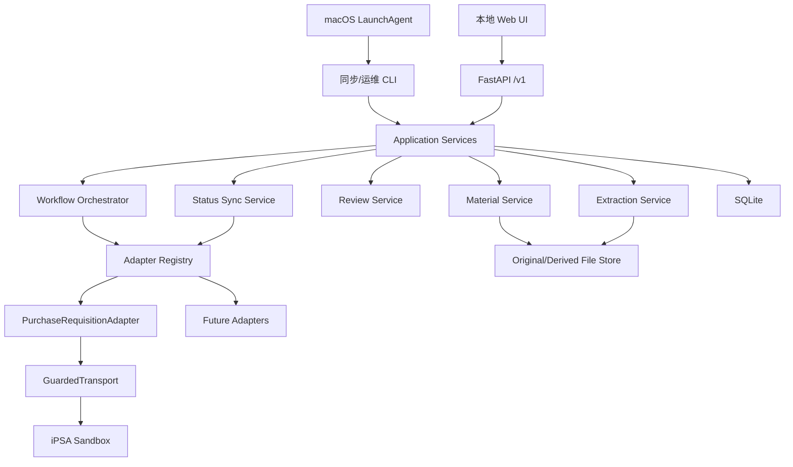
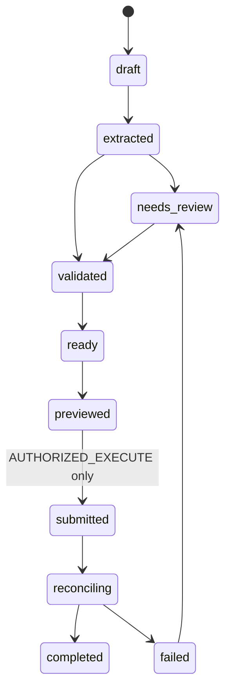

# AI 统一流程中心实施总计划

> 本文件是本项目后续实施的唯一计划基线和断点记录。任何执行者开始工作前，必须先阅读本文件、执行 `git status --short --branch`，再从“当前执行清单”中唯一标记为 `IN_PROGRESS` 的任务继续。不要另建同类计划文件。

## 文档状态

| 项目 | 当前值 |
| --- | --- |
| 计划版本 | `v1.0` |
| 最后更新 | `2026-07-15` |
| 仓库 | `/Users/ethan/Documents/isstech` |
| 基线提交 | `5a7ed71 Implement policy-gated Purchase Requisition replay baseline.` |
| 当前分支 | `main` |
| 当前总阶段 | `P3 已完成，准备阶段提交` |
| 当前安全模式 | `CTF_SAFE` |
| 计划维护规则 | 每完成一个门禁，立即更新本文件的状态、结果、文件和下一步 |

状态只使用以下四种：

- `TODO`：尚未开始。
- `IN_PROGRESS`：正在执行；全文件同时只能有一项。
- `BLOCKED`：有明确外部阻断，必须写清解除条件。
- `DONE`：已有可重复证据和验收结果，不是“代码看起来完成”。

---

## 0. 当前断点

### 0.1 本检查点之前已经完成

1. 已建立 Python/FastAPI 项目、Git 首次提交和证据隔离目录。
2. 已实现 `EndpointPolicy + GuardedTransport` 单一出网通道，未知端点默认拒绝。
3. 已确认 `GET .../Delete/{id}`、Upload、Submit、Approve 等写操作会被阻断。
4. 已实现纯 HTTP 登录代码、会话存储、申请列表、详情、附件和写请求预览。
5. `2026-07-15` 已由账号持有人手动输入凭据，使用 Chrome + Computer Use + CDP 完成成功登录及只读业务抓包。
6. 已确认以下运行态协议：
   - 成功登录 POST 字段和回跳到 Portal。
   - `SearchIndex` 初始 GET。
   - `POST /SearchIndex` 空条件查询。
   - `POST /SearchIndex/0/1/False/2` 分页。
   - `GET /Detail/{id}` 只读详情。
   - 详情中的流程轨迹字段：序号、时间、审批人、职位、操作、批注。
   - 查询列表中的当前节点字段：下一级审批人。
   - `ApprovalIndex`、`AdjustIndex`、`RevocationIndex` 初始只读列表。
   - 附件下载真实路径：`/PurchaseRequisition/Download/{id}`。
7. 原始证据均位于 `captures/raw/`，权限为 `0600`，且被 Git 忽略。
8. 已生成脱敏登录协议：`captures/redacted/login-success-protocol.json`。
9. 已参考 GitHub 类似项目：
   - `paperless-ngx/paperless-ngx`：消费插件流水线、临时目录、SHA-256 去重、失败清理和有限重试。
   - `docling-project/docling`：`DocumentConverter` 与格式专属管线分离，结构化文档作为 AI 上游边界。
   - `temporalio/samples-python`：工作流状态持久化、活动级重试和确定性编排的设计方向。
   - `n8n-io/n8n`：节点化适配、显式重试配置和人工介入点的产品形态。

### 0.2 当前未提交工作树

本检查点之前已经产生代码改动，不能丢弃或重做。当前涉及：

```text
src/isstech_replay/policy.py
src/isstech_replay/client.py
src/isstech_replay/models/purchase.py
src/isstech_replay/models/work_items.py
src/isstech_replay/parsers/purchase.py
src/isstech_replay/parsers/attachment.py
src/isstech_replay/routes/purchase_requisitions.py
src/isstech_replay/routes/work_items.py
src/isstech_replay/work_items.py
src/isstech_replay/api.py
tools/redact_login_cdp.py
tools/redact_login_har.py
tests/fixtures/purchase/*.html
tests/test_*.py
docs/openapi.json
captures/redacted/login-success-protocol.json
```

这些改动的意图是：解除四个已抓取视图的只读门禁、切换到真实 `Detail`/Download 路由、解析 `next_approver` 与 `approval_steps`，并增加 `/v1/work-items` 归一化待办接口。

### 0.3 最近一次验证结果

```text
pytest: 95 passed
ruff: passed
CDP login redactor tests: 4 passed
真实 SearchIndex 抓包解析: 78 条总数、当前页 10 条、存在下一级审批人
真实审批中详情解析: 11 个基本字段、5 个审批步骤
真实已保存详情附件解析: 5 个附件 ID 均可解析
```

`2026-07-15` P0 最终门禁结果：

```text
pytest: 95 passed
ruff: passed
OpenAPI: matches runtime
secret scan: passed
evidence hashes and permissions: passed
login protocol raw -> redacted byte comparison: passed
10 dated CDP captures: mode 0600 and gitignored
git diff --check: passed
```

P0 证据收口已经完成。README、架构说明与只读实现的一致性复核归入当前 P1。

### 0.4 当前外部阻断

1. 纯 HTTP 客户端使用真实凭据从空会话登录的 live smoke 尚未执行。密码不得写进聊天、仓库、抓包摘要或日志，只能由账号持有人放入本机环境变量。
2. 当前竞赛规则仍是“不得篡改系统数据”。因此真实新增、保存、提交、审批、调整、撤销、删除和上传全部禁止。
3. 第二角色 IDOR 验证需要另一合法比赛账号，目前没有执行条件。

---

## 1. 最终目标与性能指标

最终产品不是单一网页的协议复现工具，而是一个本地运行的 AI 统一流程中心：

```text
项目材料进入本地收件箱
→ 原文件固化与去重
→ 文档解析/OCR
→ AI 分类、字段抽取和来源定位
→ 规则校验与置信度门禁
→ 人工审阅
→ 请求预览或授权提交
→ 每日拉取流程状态
→ 快照对账与节点变化检测
→ 输出个人待办和定向催办清单
→ 人工反馈修正抽取规则
```

设计必须从以下指标出发：

| 指标 | MVP 门槛 | 稳定版门槛 |
| --- | --- | --- |
| 未授权写请求 | `0` | `0` |
| 原文件可追溯率 | `100%` SHA-256 固化 | `100%` |
| 提取字段来源覆盖率 | 所有必填字段有文件/页码/原文 | `100%` |
| 低置信度人工复核 | `< 0.85` 必须复核 | 阈值可按字段配置 |
| 提交幂等性 | 同一幂等键最多一次外部提交 | `100%` |
| 提交后回读 | 每次提交必须回读确认 | `100%` |
| 状态同步新鲜度 | 每日一次 + 手动触发 | 可配置，默认工作日 08:30 |
| 同步完整性 | 翻页直到总数满足或触发保护门限 | `100%`，禁止静默截断 |
| 失败重试 | 只读请求有限退避，写请求不自动盲重试 | 可观测、可人工恢复 |
| 待办解释性 | 当前节点、责任人、停留天数、来源流程 | `100%` |
| 秘密泄露 | 密码/Cookie/票据不进入 Git 和普通日志 | `0` |

优先级严格为：

```text
稳定性 > 可恢复性 > 正确性 > 速度 > 自动化程度 > 局部最优
```

---

## 2. 工程控制论抽象

将不同流程系统抽象成同一动态闭环：

| 控制对象 | 对应组件 |
| --- | --- |
| 对象 | 外部审批系统及其当前流程状态 |
| 控制器 | 本地编排器、状态机、规则校验器和 AI 映射器 |
| 测量 | 列表查询、详情回读、审批轨迹、附件和错误响应 |
| 执行 | `WorkflowAdapter` 的 preview/submit 方法 |
| 环境 | 网络、账号权限、目标站点变更、时延、限流和人工操作 |
| 扰动 | 页面字段变化、会话过期、网络超时、重复点击、材料缺失 |
| 饱和 | 翻页上限、附件大小上限、重试上限、AI token 上限 |
| 反馈 | 提交后回读、每日快照差异、人工纠错和失败原因 |


先证明一条最小闭环：

```text
PurchaseRequisition SearchIndex
→ 全量翻页
→ 解析状态和下一级审批人
→ 归一化 WorkItem
→ 本地保存快照
→ 输出待办清单
```

这条闭环稳定后，才增加材料 AI 和真实提交能力。

---

## 3. 安全运行模式

### 3.1 `CTF_SAFE`，当前默认

- 允许：登录、GET 页面、已确认只读 POST 查询、分页、详情、审批轨迹、附件下载。
- 允许：材料入库、AI 抽取、人工审阅、请求预览。
- 禁止：新增保存、编辑保存、提交、审批、调整、撤销、删除、上传。
- 传输层对禁止动作必须返回 `BUILD_ONLY` 或 `DENY`，不能依赖 UI 隐藏按钮。

### 3.2 `AUTHORIZED_EXECUTE`，未来显式授权后启用

- 必须由部署配置和针对流程的单独授权共同开启。
- 提交前必须生成不可变预览摘要和幂等键。
- 提交动作需要人工确认。
- 提交后必须回读外部 ID、状态和关键字段。
- 网络超时后状态不明时，先回读，不得直接重发。

严禁通过一个全局布尔值直接放开全部写操作。每个适配器、每个动作单独授权。

---

## 4. 目标架构



### 4.1 边界原则

1. AI 只做分类、抽取、映射和建议，不直接调用外部提交。
2. 所有外部请求必须经过适配器和 `GuardedTransport`。
3. 原文件、派生文本、AI 输出和最终人工确认值分开保存。
4. SQLite 保存状态和索引，不把大文件正文塞进数据库。
5. 调度器只调用可重复 CLI，不依赖 Web UI 常驻。
6. 每个同步运行都有 `run_id`、开始/结束时间、计数和错误摘要。

---

## 5. 文件与保存位置

### 5.1 当前仓库代码

| 目的 | 修改位置 | 产物保存位置 |
| --- | --- | --- |
| 端点安全分类 | `src/isstech_replay/policy.py` | 同文件 |
| 上游 HTTP 行为 | `src/isstech_replay/client.py` | 同文件 |
| 采购领域模型 | `src/isstech_replay/models/purchase.py` | 同文件 |
| 统一待办模型 | `src/isstech_replay/models/work_items.py` | 同文件 |
| 采购 HTML 解析 | `src/isstech_replay/parsers/purchase.py` | 同文件 |
| 附件 HTML 解析 | `src/isstech_replay/parsers/attachment.py` | 同文件 |
| 采购 API | `src/isstech_replay/routes/purchase_requisitions.py` | 同文件 |
| 统一待办 API | `src/isstech_replay/routes/work_items.py` | 同文件 |
| 待办归一化 | `src/isstech_replay/work_items.py` | 同文件 |
| API 注册 | `src/isstech_replay/api.py` | 同文件 |
| CDP 登录脱敏 | `tools/redact_login_cdp.py` | 脱敏 JSON 写入 `captures/redacted/` |
| 合成测试证据 | `tests/fixtures/purchase/` | 只保存 REDACTED 数据 |
| OpenAPI | `tools/export_openapi.py` | `docs/openapi.json` |
| 证据清单 | `docs/evidence-manifest.json` | 同文件 |
| 端点矩阵 | `docs/endpoint-matrix.md` | 同文件 |

### 5.2 后续新增代码

| 阶段 | 新建/修改文件 |
| --- | --- |
| SQLite 持久化 | `src/isstech_replay/storage.py`, `src/isstech_replay/schema.sql` |
| 适配器协议 | `src/isstech_replay/adapters/base.py`, `src/isstech_replay/adapters/purchase_requisition.py` |
| 同步服务 | `src/isstech_replay/sync.py`, `src/isstech_replay/routes/sync.py` |
| 同步 CLI | `tools/sync_work_items.py` 或项目脚本入口 `isstech-sync` |
| 材料入库 | `src/isstech_replay/materials.py`, `src/isstech_replay/routes/materials.py` |
| 文档解析 | `src/isstech_replay/extraction.py` |
| AI 接口 | `src/isstech_replay/ai/base.py`, `src/isstech_replay/ai/provider.py` |
| 草稿状态机 | `src/isstech_replay/workflow_state.py` |
| 人工审阅 API | `src/isstech_replay/routes/drafts.py` |
| 本地 UI | 在 API 稳定后单独立项；不得先做营销页 |
| macOS 调度 | `ops/com.isstech.workflow-center.sync.plist` |

### 5.3 运行数据目录

以下目录必须加入 `.gitignore`：

```text
data/
  workflow-center.sqlite3
  materials/
    originals/<sha256>/<original-name>
    derived/<material-id>/document.json
    derived/<material-id>/text.txt
    derived/<material-id>/pages/*.json
  runs/<run-id>/summary.json
  exports/YYYY-MM-DD-work-items.csv
  logs/workflow-center.log
```

证据目录保持：

```text
captures/raw/       原始 HAR/CDP/HTML/JS，0600，永不进 Git
captures/redacted/  经过反向泄漏检查的协议摘要，可进 Git
```

---

## 6. 核心数据模型

### 6.1 材料

```text
Material
  id
  sha256
  original_name
  mime_type
  size_bytes
  original_path
  ingest_status
  created_at

MaterialArtifact
  material_id
  kind: text | page | table | image | metadata
  path
  parser_version
```

### 6.2 带证据的字段

每个 AI 字段必须保留：

```text
ExtractedField
  field_name
  proposed_value
  confidence
  source_material_id
  source_page
  source_text
  extractor_version
  review_status
  confirmed_value
```

### 6.3 流程草稿状态机



不允许跳过 `validated`、`previewed` 和提交后 `reconciling`。

### 6.4 审批快照与待办

```text
WorkflowSnapshot
  adapter
  external_id
  reference_no
  status
  current_node
  current_approver
  submitted_at
  observed_at
  payload_hash

WorkItem
  key
  workflow
  external_id
  title
  applicant
  status
  current_approver
  waiting_days
  source_url
```

快照差异用于识别：新单据、节点变化、审批完成、责任人变化和长时间停留。

---

## 7. `WorkflowAdapter` 契约

所有流程适配器最终实现同一最小协议：

```python
class WorkflowAdapter(Protocol):
    name: str

    def list_records(self, cursor: SyncCursor | None = None) -> Page: ...
    def get_record(self, external_id: str) -> WorkflowRecord: ...
    def get_attachments(self, external_id: str) -> tuple[Attachment, ...]: ...
    def build_draft(self, confirmed_fields: dict[str, object]) -> Draft: ...
    def preview_submit(self, draft: Draft) -> RequestPreview: ...
    def submit(self, draft: Draft, authorization: ExecutionAuthorization) -> SubmitResult: ...
    def reconcile(self, result: SubmitResult) -> WorkflowRecord: ...
```

当前 `PurchaseRequisition` 是第一个适配器。`submit()` 在 `CTF_SAFE` 中必须不可达。

---

## 8. 分阶段实施

## P0 证据与登录协议收口

状态：`DONE`

### 修改文件

```text
tools/redact_login_cdp.py
tools/redact_login_har.py
tests/test_redact_login_cdp.py
captures/redacted/login-success-protocol.json
docs/evidence-manifest.json
docs/endpoint-matrix.md
docs/login-capture-runbook.md
docs/final-verification.md
docs/vulnerability-report.md
tools/verify_evidence.py
```

### 操作步骤

1. 用 `tools/redact_login_cdp.py` 从原始 CDP JSON重新生成脱敏摘要。
2. 确认摘要只包含字段名、状态码、允许的 URL、Cookie 名和属性，不含值。
3. 将 `2026-07-15` 原始证据哈希、权限、来源和敏感级别登记到单一 manifest。
4. 将旧的 `login-success-har` gap 改为“成功 CDP 已捕获，纯 HTTP live smoke 待凭据”。
5. 运行秘密扫描和证据校验。

### 验收

```text
redactor unit tests pass
login protocol reproducible from raw capture
raw files mode 0600
raw files ignored by Git
redacted protocol contains no credential/cookie/ticket values
evidence manifest hashes all match
```

### 实际结果（2026-07-15）

- 十个 CDP raw 文件和一个脱敏登录摘要已登记到 manifest，哈希匹配。
- raw CDP 全部是 `0600` 且命中 `captures/raw/**` Git 忽略规则。
- 登录摘要能由 `tools/redact_login_cdp.py` 从 raw 逐字节重建。
- 摘要明确记录浏览器请求已携带 `.iPSA` 名称，不把该证据误写成干净会话签发证明。
- 全量 `pytest` 95 项、Ruff、OpenAPI、秘密扫描、证据校验和 diff 检查全部通过。
- 剩余登录门禁是运行时凭据驱动的纯 HTTP live smoke，不需要再次浏览器导航。

## P1 PurchaseRequisition 只读适配器闭环

状态：`DONE`

### 修改文件

```text
src/isstech_replay/policy.py
src/isstech_replay/client.py
src/isstech_replay/models/purchase.py
src/isstech_replay/parsers/purchase.py
src/isstech_replay/parsers/attachment.py
src/isstech_replay/routes/purchase_requisitions.py
tests/fixtures/purchase/*.html
tests/test_purchase.py
tests/test_attachments.py
tests/test_safety.py
tests/test_api.py
README.md
docs/architecture.md
docs/scope.md
docs/endpoint-matrix.md
```

### 操作步骤

1. 精确放行五个列表视图的 GET 和已观察到的只读 POST。
2. 保持 Delete/Submit/Approve/Adjust/Revocation/Upload 等写路径优先匹配 `BUILD_ONLY`。
3. 使用真实 `/Detail/{id}`，不再把 `/Edit/{id}` 当默认详情来源。
4. 使用真实 `/PurchaseRequisition/Download/{id}` 下载附件，旧静态路径只保留兼容规则。
5. 列表解析增加 `next_approver`。
6. 详情解析增加基本信息和 `approval_steps`。
7. 修复 onclick 带引号的附件 ID 解析。
8. 用脱敏合成夹具测试，再用本机 raw capture 做不输出业务数据的反向校验。

### 验收

```text
five views are live-enabled read-only
SearchIndex POST and pagination POST reproduce observed paths
Detail parser returns fields and approval steps
attachment parser matches all observed attachment IDs
all write-path policy tests still block before transport
```

### 实际结果（2026-07-15）

- Search raw 反向解析为总数 78、当前页 10、ID 全部非空且存在下一级审批人。
- 已保存 Detail raw 反向解析为 11 个字段、5 个附件、5 个下载 ID。
- 审批中 Detail raw 反向解析为 11 个字段、5 个审批步骤且审批人字段完整。
- `Detail/{id}` 是唯一 live 详情规则；未观察的 `Details/View/Display` 别名被拒绝。
- `Edit/{id}` 与 `ProjectSelection` 在 `CTF_SAFE` 下改为 `BUILD_ONLY`，不再出网。
- Delete/Submit/Approve/Adjust/Revocation/Upload/Attachment Delete 动作矩阵全部在 transport 前阻断。
- Search 首次筛选和分页 POST 字段与 CDP 对齐；分页不再携带 `btnSearch` 或表单内 `X-Requested-With`。
- 上游 4xx/5xx、列表 DOM 漂移、详情 DOM 漂移和附件 HTML 错误页均显式失败，不再静默产出空结果或错误哈希。
- 全量 `pytest` 111 项、Ruff、OpenAPI、秘密扫描、证据校验和 diff 检查全部通过。

## P2 统一待办只读输出

状态：`DONE`

### 修改文件

```text
src/isstech_replay/models/work_items.py
src/isstech_replay/work_items.py
src/isstech_replay/routes/work_items.py
src/isstech_replay/api.py
tests/test_work_items.py
tests/test_api.py
docs/openapi.json
```

### 操作步骤

1. 将 `SearchIndex` 中“审批中且存在下一级审批人”的记录归一化为 `WorkItem`。
2. 计算停留天数，解析失败时返回 `null`，禁止猜日期。
3. 全量同步必须逐页读取，满足总数、空页、重复页或 `max_pages` 任一终止条件。
4. 输出按停留天数降序排列。
5. `/v1/work-items` 第一版只返回实时结果，不写数据库。

### 验收

```text
GET /v1/work-items returns only actionable records
every item has workflow, external_id, current_approver, status, source_url
pagination cannot silently loop forever
OpenAPI matches runtime
```

### 实际结果（2026-07-15）

- `/v1/work-items` 只输出“审批中且存在下一级审批人”的记录，真实 Search raw 得到 1 条可催办项。
- 每项均有 workflow、合法 external_id、current_approver、status 和真实 `Detail/{id}` source URL。
- `waiting_days` 以申请创建日期为当前可得的等待年龄基准；非法或未来日期返回 `null`，不猜测为 0。
- 排序为已知等待天数降序、未知日期最后，并用 reference/external ID 保证确定性。
- 全量翻页只有在达到上游声明总数，或无声明总数时观察到可信末页才成功。
- 短页、空页、重复页、总数漂移、无稳定身份和 `max_pages` 饱和均抛出 `PaginationIncompleteError`，禁止静默截断。
- 本地 API 冒烟：`/health` 200、`/docs` 200、OpenAPI 包含 work-items；无凭据 purchase/work-items 均为 401 `AUTH_EXPIRED`。
- 全量 `pytest` 121 项、Ruff、OpenAPI、秘密扫描、证据校验和 diff 检查全部通过。

## P3 SQLite 快照、差异和同步 CLI

状态：`DONE`

### 修改文件

```text
.gitignore
src/isstech_replay/schema.sql
src/isstech_replay/storage.py
src/isstech_replay/sync.py
src/isstech_replay/routes/sync.py
tools/sync_work_items.py
tests/test_storage.py
tests/test_sync.py
```

### 操作步骤

1. 建立 SQLite schema 和 `PRAGMA user_version` 迁移门禁。
2. 每次同步建立 `sync_run`，事务内写入快照和差异。
3. 使用 `(adapter, external_id, observed_at)` 保留历史，使用 payload hash 避免无变化重复事件。
4. 生成 `new`、`node_changed`、`completed`、`assignee_changed` 事件。
5. CLI 支持 `--dry-run`、`--json`、`--csv`、`--max-pages`。
6. CLI 失败必须非零退出，不能静默吞掉半次同步。

### 保存位置

```text
data/workflow-center.sqlite3
data/runs/<run-id>/summary.json
data/exports/YYYY-MM-DD-work-items.csv
```

### 验收

```text
same snapshot replay is idempotent
node change produces exactly one event
failed run is recorded and transaction remains consistent
CSV contains no password/cookie/ticket
```

### 实际结果（2026-07-15）

- SQLite schema version 1 已建立，wheel 内含 `schema.sql`；未来版本、未版本化非空库和缺表库均拒绝打开。
- 数据库、run JSON 和 CSV 路径位于 `data/`，全部 Git 忽略；创建文件权限为 `0600`。
- 同步先完整读取，再在一个事务内追加历史、更新当前态、生成事件并完成 run；任一快照失败时整批回滚。
- 失败同步和 CLI 登录失败均写 `failed` run，错误信息会脱敏 password/Cookie/ticket/token 等值。
- 相同状态次日重放追加测量但不重复生成事件；相同观测键同 payload 复用历史，不同 payload 冲突失败。
- 支持 `new`、`node_changed`、`assignee_changed`、`completed`；active 转终态只生成一个 completed，避免节点/责任人清空噪声。
- 过期观测不能覆盖较新的 current；单次缺失不被猜成 completed。
- CLI 支持 `--dry-run`、`--json`、`--csv [PATH]`、`--max-pages`，失败非零退出，CSV 防公式注入。
- FastAPI 新增 `POST /v1/sync/work-items`，只修改本机 SQLite；`dry_run=true` 不创建数据库。
- 全量 `pytest` 141 项、Ruff、OpenAPI、秘密扫描、证据校验、Git 忽略、diff 和本地 API 冒烟全部通过。

## P4 本地材料入库

状态：`TODO`

### 修改文件

```text
src/isstech_replay/materials.py
src/isstech_replay/routes/materials.py
tests/test_materials.py
```

### 操作步骤

1. 提供拖入目录和 API 上传两种入口。
2. 流式计算 SHA-256，先写临时文件，再原子移动到 originals。
3. 同哈希文件只建立引用，不重复复制。
4. 原文件只读保存，派生产物写 derived。
5. MIME、扩展名和文件头不一致时进入人工检查。

### 验收

```text
duplicate ingest is idempotent
interrupted copy leaves no valid record pointing to partial file
original is never overwritten by derived output
```

## P5 文档解析与 AI 字段抽取

状态：`TODO`

### 工具选择

- PDF/DOCX/XLSX/PPTX 优先用当前工作区已有解析能力。
- 复杂 PDF/OCR 评估 Docling；只有真实样本证明标准工具不足时才引入重依赖。
- AI provider 必须可插拔，密钥只从环境或系统钥匙串读取。

### 修改文件

```text
src/isstech_replay/extraction.py
src/isstech_replay/ai/base.py
src/isstech_replay/ai/provider.py
src/isstech_replay/field_mapping.py
tests/test_extraction.py
tests/test_field_mapping.py
```

### 验收

```text
every proposed field has source material/page/text
required fields without evidence cannot become ready
AI output cannot directly call adapter submit
```

## P6 人工审阅与草稿状态机

状态：`TODO`

### 修改文件

```text
src/isstech_replay/workflow_state.py
src/isstech_replay/routes/drafts.py
tests/test_workflow_state.py
```

### 验收

```text
invalid state transitions are rejected
review changes preserve original AI proposal and reviewer identity
ready state requires all mandatory validations
```

## P7 一键提交双模式

状态：`BLOCKED`

解除条件：赛事规则明确允许写入，或提供专用可回滚测试记录。

### 当前可做

- AI 填写。
- 人工确认。
- 生成精确请求预览。
- 计算幂等键和预览摘要。
- 拦截并中止浏览器写请求用于协议取证。

### 当前不可做

- 向目标发送真实 Create/Edit/Submit/Approve/Adjust/Revoke/Delete/Upload。

## P8 每日调度

状态：`TODO`

### 设施

- macOS `launchd`，不使用依赖 Web UI 存活的内置定时器。
- LaunchAgent：`ops/com.isstech.workflow-center.sync.plist`。
- 默认每天工作日 08:30，最终时间由用户确认。
- 凭据优先系统钥匙串或受限环境注入，不写 plist 明文。

### 验收

```text
manual CLI and scheduled CLI execute same code path
app closed时 schedule still works
failure has exit code, run record and可定位日志
```

## P9 第二个流程适配器

状态：`TODO`

只有 P0-P8 的第一条闭环稳定后才能开始。选择标准是：材料与字段结构明确、状态查询可只读、用户使用频率高、授权边界清楚。

---

## 9. 网站清单

### 9.1 比赛目标，仅在授权沙箱范围使用

| 用途 | 网站 |
| --- | --- |
| Portal | `http://ipsapro.isstech.com/Portal` |
| 采购入口 | `http://ipsapro.isstech.com/WebTP/PurchaseRequisition` |
| 采购查询 | `http://ipsapro.isstech.com/WebTP/PurchaseRequisition/SearchIndex` |
| 采购审批待办 | `http://ipsapro.isstech.com/WebTP/PurchaseRequisition/ApprovalIndex` |
| 采购调整列表 | `http://ipsapro.isstech.com/WebTP/PurchaseRequisition/AdjustIndex` |
| 采购撤销列表 | `http://ipsapro.isstech.com/WebTP/PurchaseRequisition/RevocationIndex` |
| Passport | `https://passport.isstech.com/` |

禁止访问与当前适配器无关的用户目录、凭据存储和其他业务系统。

### 9.2 本地网站

| 用途 | URL |
| --- | --- |
| API | `http://127.0.0.1:8000` |
| Swagger | `http://127.0.0.1:8000/docs` |
| OpenAPI | `http://127.0.0.1:8000/openapi.json` |
| 健康检查 | `http://127.0.0.1:8000/health` |

### 9.3 GitHub 参考

| 项目 | 只参考什么 |
| --- | --- |
| `https://github.com/paperless-ngx/paperless-ngx` | 消费目录、去重、插件阶段、临时目录和失败清理 |
| `https://github.com/docling-project/docling` | 文档转换边界、格式管线和结构化输出 |
| `https://github.com/temporalio/samples-python` | 状态持久化、有限重试、活动与编排分离 |
| `https://github.com/n8n-io/n8n` | 适配器/节点形态、人工节点和执行可观测性 |

不直接复制这些大型项目的架构；只吸收已经解决本项目真实问题的最小模式。

---

## 10. 工具与设施

| 工作 | 工具 |
| --- | --- |
| Python 环境 | `uv`, Python 3.11, `.venv/` |
| API | FastAPI, Pydantic, Uvicorn |
| 上游 HTTP | `httpx`，必须包在 `GuardedTransport` 中 |
| 浏览器取证 | Chrome + Computer Use + CDP；只用于分析和 live 验证 |
| HTML 解析 | Python `HTMLParser`，按已观察 DOM 结构解析 |
| 数据库 | SQLite，标准库 `sqlite3` |
| 文档解析 | 标准工具优先；复杂样本再评估 Docling |
| 单元/契约测试 | `pytest`, `httpx.MockTransport` |
| 静态检查 | `ruff` |
| 秘密扫描 | `tools/verify_no_secrets.py` |
| 证据校验 | `tools/verify_evidence.py` |
| OpenAPI 导出 | `tools/export_openapi.py` |
| 调度 | macOS `launchctl` / LaunchAgent |
| 数据检查 | `sqlite3`, `jq`, `rg`, `shasum` |

设施约束：

1. 本地 API 只绑定 `127.0.0.1`。
2. SQLite 和材料目录不进 Git。
3. raw 证据和含业务数据的运行日志权限至少 `0600`。
4. 任何自动同步必须有超时、翻页上限、附件大小上限和重试上限。

---

## 11. 当前执行清单

严格按顺序执行，不允许同时推进多个阶段：

| 顺序 | 状态 | 任务 | 完成门禁 |
| --- | --- | --- | --- |
| 1 | `DONE` | P0 证据、脱敏、manifest 和文档收口 | 95 tests + 哈希/权限/秘密扫描全部通过 |
| 2 | `DONE` | P1 复核当前未提交的只读适配器改动 | 111 tests + raw 反向校验 + 写路径全阻断 |
| 3 | `DONE` | P2 复核 `/v1/work-items` 与全量翻页 | 121 tests + raw WorkItem 校验 + 本地 API 冒烟通过 |
| 4 | `DONE` | 阶段性提交 P0-P2 | `f360595 Implement evidence-backed read-only work item flow` |
| 5 | `DONE` | P3 SQLite 快照和手动同步 CLI | 141 tests + 幂等/差异/失败事务/API 冒烟通过 |
| 6 | `IN_PROGRESS` | P3 阶段性提交 | 提交只包含 P3 代码、文档和测试 |
| 7 | `TODO` | P4 材料入库 | 原文件固化与去重闭环通过 |
| 8 | `TODO` | P5 AI 抽取接口与来源证据 | 每个字段可追溯且低置信度被拦截 |
| 9 | `TODO` | P6 人工审阅 | 状态机和审计测试通过 |
| 10 | `BLOCKED` | P7 真实一键提交 | 等待明确写授权 |
| 11 | `TODO` | P8 每日调度 | 手动与调度同路径、失败可见 |

---

## 12. 每个检查点的固定命令

```bash
cd /Users/ethan/Documents/isstech

git status --short --branch
.venv/bin/pytest -q
.venv/bin/ruff check src tests tools
.venv/bin/python tools/export_openapi.py
.venv/bin/python tools/verify_no_secrets.py
.venv/bin/python tools/verify_evidence.py
git diff --check
```

启动本地 API：

```bash
cd /Users/ethan/Documents/isstech
uv run uvicorn isstech_replay.api:app --host 127.0.0.1 --port 8000
```

检查：

```bash
curl -sS http://127.0.0.1:8000/health
curl -sS http://127.0.0.1:8000/openapi.json
```

真实凭据 live smoke 只能由账号持有人在本机终端设置环境变量：

```bash
export ISSTECH_USERNAME='...'
export ISSTECH_PASSWORD='...'
.venv/bin/python tools/live_smoke.py
unset ISSTECH_PASSWORD
```

密码、Cookie、票据和原始 HAR/CDP 内容不得粘贴到聊天。

---

## 13. 断点恢复规程

任何新任务或上下文恢复后，按以下步骤执行：

1. 阅读本文件的“当前断点”和“当前执行清单”。
2. 执行 `git status --short --branch` 和 `git log -1 --oneline`。
3. 检查是否存在用户未提交改动；不得覆盖或回退。
4. 只继续唯一的 `IN_PROGRESS` 项。
5. 完成后先跑该阶段最小测试，再跑全部固定门禁。
6. 更新本文件：状态、实际修改文件、测试结果、遗留问题和下一项。
7. 再进行提交或进入下一阶段。

如果运行态与源码冲突，按以下证据优先级处理：

```text
当前运行行为
> 当前网络抓包
> 当前页面资产
> 进程配置
> 持久化状态
> 生成物
> 仓库源码
> 注释和死代码
```

---

## 14. 已知风险与控制措施

| 风险 | 控制措施 |
| --- | --- |
| 旧系统使用 POST 做只读查询 | 不能按 HTTP 方法粗分；必须按精确 host + path + action 分类 |
| GET 也可能写数据 | Delete 等路径优先匹配 `BUILD_ONLY` |
| 会话过期返回 200 登录页 | 每次响应做登录页识别 |
| 网络超时导致提交状态不明 | 写模式先回读，不直接重试 |
| 翻页结构变化造成漏单 | 总数对账、重复页检测、最大页数保护 |
| AI 幻觉字段 | 必填来源证据、置信度门禁、人工确认 |
| 原文件被派生产物覆盖 | originals/derived 分离，原子写入，只读原件 |
| 重复材料和重复提交 | SHA-256 去重、幂等键、提交后回读 |
| 敏感信息进入 Git | raw gitignore、0600、秘密扫描、脱敏反向检查 |
| 调度依赖应用窗口 | 使用 LaunchAgent 调用 CLI，不依赖 UI 常驻 |

---

## 15. 最终验收定义

只有以下端到端流程均可从干净状态重复，项目才算达到最终目标：

1. 把一组脱敏项目材料放入本地收件箱。
2. 系统固化原文件并生成 SHA-256。
3. 文档解析和 AI 输出带页码与原文证据的字段建议。
4. 人工修正确认后进入 `ready`。
5. `CTF_SAFE` 下生成不可发送的请求预览；授权模式下才可人工确认提交。
6. 提交后回读获得外部 ID 和状态。
7. 次日同步完整翻页并写入新快照。
8. 节点变化只产生一次差异事件。
9. 待办清单按停留天数输出当前责任人和来源链接。
10. 全过程不泄露凭据、不重复提交、不静默丢页、失败可恢复。

当前最近的可交付里程碑是 P0-P3：

```text
成功登录证据
→ PurchaseRequisition 五视图只读适配器
→ 全量节点同步
→ SQLite 快照差异
→ 本地待办/催办清单
```

完成这个闭环后，再开始材料和 AI 阶段。
